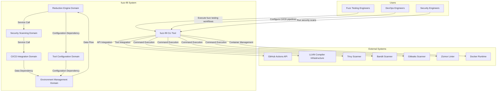

# fuzz-fill System Context Documentation

## 1. Project Introduction

### 1.1 Project Overview

**fuzz-fill** is a command-line tool designed to optimize fuzz testing workflows by reducing redundant test cases and automating security vulnerability scanning within CI/CD pipelines. The system operates as a CLI-driven application written primarily in Python, integrating with external tools through command execution and API clients.

### 1.2 Core Business Value

The fuzz-fill system delivers significant business value through three primary capabilities:

1. **Test Case Reduction**: Analyzes LLVM IR to identify coverage gaps and reduces test cases, improving fuzz testing efficiency by eliminating redundant inputs
2. **Automated Security Scanning**: Integrates with CI/CD pipelines to automatically scan dependencies, infrastructure as code, and GitHub Actions workflows for vulnerabilities
3. **Coverage Gap Analysis**: Identifies gaps in code coverage to improve software quality and security posture

### 1.3 Technical Characteristics

- **Architecture Pattern**: Layered architecture with clear separation between core business logic, tool support, and infrastructure
- **Implementation Language**: Python as the primary implementation language
- **Integration Approach**: CLI-driven with external tool integration through command execution and API clients
- **Deployment Model**: Docker-based isolation for CI/CD workflows
- **Primary Interface**: Command-line interface (CLI)

---

## 2. Target Users

### 2.1 User Role Definitions

| User Role | Description | Primary Needs |
|-----------|-------------|---------------|
| **Fuzz Testing Engineers** | Engineers who develop and maintain fuzz testing infrastructure for software projects | Automated test case reduction, coverage gap identification, efficient fuzz testing workflows |
| **DevOps Engineers** | Engineers responsible for CI/CD pipeline configuration and automation | GitHub Actions integration, Docker image management, build automation scripts |
| **Security Engineers** | Engineers who conduct security analysis and vulnerability scanning | Dependency vulnerability scanning, secret detection, workflow security linting |

### 2.2 Usage Scenarios

#### Scenario 1: Fuzz Testing Optimization
Fuzz Testing Engineers use fuzz-fill to analyze LLVM IR from fuzz testing runs, identify coverage gaps, and reduce test cases to improve testing efficiency.

#### Scenario 2: CI/CD Security Integration
DevOps Engineers integrate fuzz-fill into GitHub Actions workflows to automatically scan dependencies, infrastructure as code, and workflows for security vulnerabilities during the build pipeline.

#### Scenario 3: Security Compliance Verification
Security Engineers leverage fuzz-fill's security scanning capabilities to verify that dependencies, secrets, and workflows meet security compliance requirements before deployment.

---

## 3. System Boundaries

### 3.1 System Scope Definition

The fuzz-fill system is a **Command-Line Tool** that provides fuzz test case reduction and gap analysis functionality with integrated CI/CD security scanning capabilities.

### 3.2 Included Components

The following components are **included** within the fuzz-fill system boundary:

| Component | Description |
|-----------|-------------|
| **Test Case Reduction Engine** | Core logic for analyzing LLVM IR and reducing test cases (reducer.py, reducer_pass.py) |
| **LLVM Tool Integration** | Configuration and execution of LLVM tools for code analysis |
| **GitHub Actions API Client** | Library for CI/CD automation and workflow management |
| **Security Scanning Tools** | Integration with trivy, bandit, gitleaks, and zizmor for vulnerability detection |
| **Docker Image Management** | Scripts for building and managing test environment images |
| **Coverage Analysis Utilities** | Tools for identifying and analyzing code coverage gaps |
| **Configuration Management** | JSON-based configuration parsing and pipeline step definition |
| **Logging and Timing Utilities** | Logging configuration, file output, and timing recording functionality |

### 3.3 Excluded Components

The following components are **excluded** from the fuzz-fill system boundary:

| Component | Reason for Exclusion |
|-----------|---------------------|
| **Actual Fuzz Testing Engine** | External system that fuzz-fill optimizes but does not implement |
| **Target Codebase Being Tested** | External system under fuzz testing analysis |
| **LLVM Compiler Itself** | External tool integrated via command execution |
| **Test Frameworks and Test Suites** | External systems that fuzz-fill analyzes |
| **Production Deployment Infrastructure** | External systems for deployment and runtime execution |

---

## 4. External System Interactions

### 4.1 External System Inventory

The fuzz-fill system interacts with the following external systems:

| External System | Interaction Type | Purpose |
|-----------------|------------------|---------|
| **GitHub Actions API** | API Integration | Workflow commands, REST API access, authentication for CI/CD automation |
| **LLVM Compiler Infrastructure** | Tool Integration | Code analysis and reduction operations on LLVM IR |
| **Trivy** | Command Execution | Vulnerability scanning for dependencies and infrastructure as code |
| **Bandit** | Command Execution | Python security static analysis for codebase security issues |
| **Gitleaks** | Command Execution | Detection of hardcoded credentials and secrets in code |
| **Zizmor** | Command Execution | GitHub Actions workflow security linting and misconfiguration detection |
| **Docker** | Container Management | Building and running test environments with appropriate package dependencies |

### 4.2 Interaction Analysis

#### 4.2.1 API Integration (GitHub Actions API)
- **Direction**: fuzz-fill → GitHub Actions API
- **Purpose**: Orchestrates CI/CD workflows, manages build pipelines, and triggers security scanning
- **Authentication**: Uses GitHub Actions API authentication mechanisms
- **Impact**: Enables automated integration with GitHub Actions workflows

#### 4.2.2 Tool Integration (LLVM, Trivy, Bandit, Gitleaks, Zizmor)
- **Direction**: fuzz-fill → External Tools (Command Execution)
- **Purpose**: Execute security scanning and code analysis operations
- **Integration Method**: Command-line execution with configurable parameters
- **Impact**: Provides comprehensive security and code analysis capabilities

#### 4.2.3 Container Management (Docker)
- **Direction**: fuzz-fill ↔ Docker
- **Purpose**: Build and manage isolated test environments
- **Integration Method**: Docker image building and container runtime
- **Impact**: Ensures reproducible and isolated testing environments

---

## 5. System Context Diagram

### 5.1 System Context Diagram

### 5.2 Key Interaction Flows

#### Flow 1: Test Case Reduction Workflow
1. **Entry Point**: `/var/home/a/wikiwork/fuzz-fill/clone/src/reduce/__main__.py`
2. **Process**:
   - Tool Configuration Domain resolves LLVM tool paths from CLI flags and environment variables
   - Reduction Engine Domain loads and parses reduction configuration from JSON files
   - Reduction Engine executes reduction passes (SnapshotPass, LlvmReduceIrPass, etc.) on LLVM IR
   - Reduction Engine orchestrates reduction pipeline and manages test execution context
3. **Output**: Reduced test cases with improved coverage efficiency

#### Flow 2: Security Scanning Workflow
1. **Entry Point**: `/var/home/a/wikiwork/fuzz-fill/clone/scripts/github_actions/scan_tools/trivy.py`
2. **Process**:
   - CI/CD Integration Domain initializes GitHub Actions API client with authentication
   - Security Scanning Domain executes trivy to scan dependencies and IaC files for vulnerabilities
   - Security Scanning Domain runs zizmor to analyze GitHub Actions workflows for security misconfigurations
   - Security Scanning Domain executes bandit to detect Python security issues in codebase
   - Security Scanning Domain runs gitleaks to detect hardcoded credentials and secrets
3. **Output**: Security vulnerability reports in SARIF and non-SARIF formats

#### Flow 3: Docker Image Build Workflow
1. **Entry Point**: `/var/home/a/wikiwork/fuzz-fill/clone/scripts/docker/build-image.sh`
2. **Process**:
   - Environment Management Domain loads package requirements for builder, runtime, source, or release profiles
   - Environment Management Domain executes apt package installation script for selected image profile
   - CI/CD Integration Domain builds Docker image using GitHub Actions workflow
3. **Output**: Docker images with appropriate package dependencies for CI/CD stages

---

## 6. Technical Architecture Overview

### 6.1 Technology Stack

| Layer | Technology | Purpose |
|-------|-----------|---------|
| **Implementation Language** | Python | Primary application development |
| **CLI Framework** | Python CLI | Command-line interface implementation |
| **External Tools** | LLVM, Trivy, Bandit, Gitleaks, Zizmor | Code analysis and security scanning |
| **Container Runtime** | Docker | Isolated test environment management |
| **CI/CD Platform** | GitHub Actions | Pipeline orchestration and automation |
| **Configuration Format** | JSON | Configuration file format |

### 6.2 Architecture Patterns

#### 6.2.1 Dependency Injection
- **Application**: Tool configuration for external tool integration
- **Purpose**: Decouples tool dependencies from core business logic
- **Benefit**: Enables flexible tool substitution and configuration management

#### 6.2.2 Registry Pattern
- **Application**: Pass registry for reduction pass management
- **Purpose**: Maps reduction pass IDs to their corresponding pass classes
- **Benefit**: Enables lazy loading to avoid circular import issues

#### 6.2.3 Orchestration Pattern
- **Application**: Pipeline execution for reduction and scanning workflows
- **Purpose**: Coordinates multiple tool executions in defined sequences
- **Benefit**: Provides consistent workflow execution and error handling

### 6.3 Key Design Decisions

| Decision | Rationale | Impact |
|----------|-----------|--------|
| **CLI-Driven Architecture** | Aligns with developer tooling conventions | Enables scriptable automation and integration |
| **Layered Architecture** | Separates concerns between business logic, tools, and infrastructure | Improves maintainability and testability |
| **Docker-Based Isolation** | Ensures reproducible environments | Eliminates environment-specific issues |
| **External Tool Integration** | Leverages mature security and analysis tools | Reduces development overhead and improves quality |
| **JSON Configuration** | Human-readable and tool-friendly | Simplifies configuration management |

### 6.4 Domain Architecture Summary

| Domain | Type | Importance | Complexity | Primary Responsibility |
|--------|------|------------|------------|----------------------|
| **Reduction Engine Domain** | Core Business | 9.0 | 8.5 | LLVM IR analysis and test case reduction |
| **Security Scanning Domain** | Tool Support | 7.5 | 7.0 | Vulnerability and security issue detection |
| **CI/CD Integration Domain** | Infrastructure | 7.0 | 6.0 | GitHub Actions API integration and workflow automation |
| **Environment Management Domain** | Infrastructure | 6.5 | 5.0 | Docker image management and package configuration |
| **Tool Configuration Domain** | Support | 7.0 | 5.5 | LLVM tool paths and environment variable resolution |

---

## 7. Architecture Decision Record (ADR) Summary

### 7.1 ADR-001: CLI-Driven Architecture
- **Decision**: Implement fuzz-fill as a command-line tool
- **Rationale**: Aligns with developer tooling conventions and enables scriptable automation
- **Status**: Implemented

### 7.2 ADR-002: External Tool Integration
- **Decision**: Integrate with mature external tools (LLVM, Trivy, Bandit, etc.)
- **Rationale**: Leverages existing expertise and reduces development overhead
- **Status**: Implemented

### 7.3 ADR-003: Docker-Based Isolation
- **Decision**: Use Docker for environment management
- **Rationale**: Ensures reproducible and isolated testing environments
- **Status**: Implemented

### 7.4 ADR-004: Layered Architecture
- **Decision**: Separate core business logic, tool support, and infrastructure
- **Rationale**: Improves maintainability and enables independent testing
- **Status**: Implemented

---

## 8. Appendix

### 8.1 System Entry Points

| Entry Point | Domain | Function |
|-------------|--------|----------|
| `/var/home/a/wikiwork/fuzz-fill/clone/src/reduce/__main__.py` | Reduction Engine | Main entry point for test case reduction |
| `/var/home/a/wikiwork/fuzz-fill/clone/scripts/github_actions/scan_tools/trivy.py` | Security Scanning | Trivy vulnerability scanner entry point |
| `/var/home/a/wikiwork/fuzz-fill/clone/scripts/docker/build-image.sh` | CI/CD Integration | Docker image build script |

### 8.2 Key Configuration Files

| File | Purpose |
|------|---------|
| `/var/home/a/wikiwork/fuzz-fill/clone/src/reduce/config.py` | Reduction configuration management |
| `/var/home/a/wikiwork/fuzz-fill/clone/scripts/image/apt/builder.packages` | Builder package dependencies |
| `/var/home/a/wikiwork/fuzz-fill/clone/scripts/image/apt/runtime.packages` | Runtime package dependencies |

### 8.3 Document Metadata

- **Document Title**: fuzz-fill System Context Documentation
- **Document Level**: C4 SystemContext
- **Last Updated**: 2026-09-13 20:09:19 (UTC)
- **Confidence Score**: 8.5/10
- **Document Owner**: Architecture Team