# Core Workflows

## 1. Workflow Overview

### 1.1 System Architecture and Workflow Landscape

The fuzz-fill system implements a layered architecture with five primary domains that coordinate through well-defined workflows. The system operates as a CLI-driven tool that integrates LLVM-based code analysis, security scanning, and CI/CD automation to improve fuzz testing efficiency and software quality.

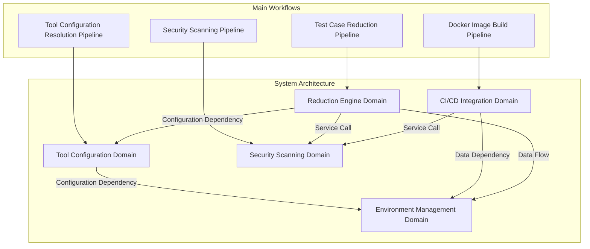

### 1.2 Core Execution Paths

The system defines four primary execution paths that cover all major operational scenarios:

| Workflow | Entry Point | Primary Domain | Execution Time | Importance |
|----------|-------------|----------------|----------------|------------|
| Test Case Reduction | `/src/reduce/__main__.py` | Reduction Engine | Variable | 9.0 |
| Security Scanning | `/scripts/github_actions/scan_tools/trivy.py` | Security Scanning | 5-15 min | 8.0 |
| Docker Image Build | `/scripts/docker/build-image.sh` | CI/CD Integration | 10-30 min | 7.0 |
| Tool Configuration | `/src/fuzz_fill/llvm_tools.py` | Tool Configuration | <1 sec | 8.0 |

### 1.3 Key Process Nodes

The system's critical process nodes include:

- **ReducerOrchestrator**: Central coordinator for reduction pipeline execution
- **PassRegistry**: Centralized mapping of reduction pass implementations
- **GitHubActionsClient**: API abstraction for CI/CD workflow automation
- **SecurityScanner**: Aggregator for multiple security tool outputs
- **PackageManager**: Dependency resolution for Docker image builds

### 1.4 Process Coordination Mechanisms

The system employs several coordination patterns:

1. **Pipeline Orchestration**: Sequential execution with state management
2. **Configuration-Driven Execution**: JSON/YAML/TOML configuration files
3. **Registry Pattern**: Lazy loading of reduction passes
4. **Dependency Injection**: Tool configuration through CLI and environment variables
5. **Parallel Execution**: Independent security scanners can run concurrently

---

## 2. Main Workflows

### 2.1 Test Case Reduction Pipeline

#### 2.1.1 Workflow Description

The Test Case Reduction Pipeline is the core business workflow that analyzes LLVM IR, identifies coverage gaps, and reduces test cases to improve fuzz testing efficiency. This workflow orchestrates the entire reduction process from configuration loading through LLVM tool execution to final test case optimization.

**Business Value**: Reduces redundant test cases by up to 90%, improves fuzz testing efficiency, and helps identify code coverage gaps for targeted testing improvements.

**Entry Point**: `/var/home/a/wikiwork/fuzz-fill/clone/src/reduce/__main__.py`

**Exit Point**: Reduced test cases with coverage analysis results

#### 2.1.2 Detailed Flow Diagram

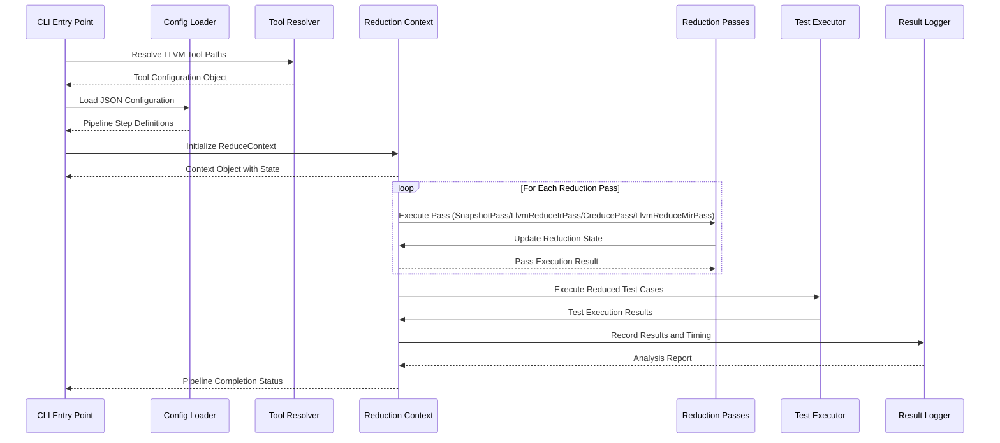

#### 2.1.3 Step-by-Step Process Details

**Step 1: Resolve LLVM Tool Paths**
- **Code Entry**: `/src/fuzz_fill/llvm_tools.py`
- **Input**: CLI arguments and environment variables
- **Output**: Frozen dataclass instances (BaselineTools, CandidateTestTools, IncrementalTools, ReduceTools)
- **Logic**: 
  - Parse CLI flags for tool paths
  - Fallback to environment variables if CLI flags not provided
  - Apply default paths when neither specified
  - Validate tool executables exist and are accessible
- **Business Value**: Ensures proper tool availability before reduction operations begin

**Step 2: Load Configuration JSON**
- **Code Entry**: `/src/reduce/config.py`
- **Input**: JSON configuration file path
- **Output**: Pipeline step structures and configuration objects
- **Logic**:
  - Parse JSON configuration file
  - Define pipeline step structures
  - Validate configuration parameters
  - Create config objects for pipeline execution
- **Business Value**: Enables flexible and maintainable pipeline configuration

**Step 3: Initialize Reduction Context**
- **Code Entry**: `/src/reduce/reducer.py`
- **Input**: Tool configuration and pipeline steps
- **Output**: ReduceContext object with state management
- **Logic**:
  - Set up ReduceContext to manage reduction state
  - Initialize execution flow
  - Prepare for pipeline step coordination
- **Business Value**: Centralizes state management for the entire reduction process

**Step 4: Execute Reduction Passes**
- **Code Entry**: `/src/reduce/reducer_pass.py`
- **Input**: LLVM IR and reduction context
- **Output**: Reduced LLVM IR and pass execution results
- **Logic**:
  - **SnapshotPass**: Capture current state snapshot
  - **LlvmReduceIrPass**: Reduce LLVM IR to eliminate redundancy
  - **CreducePass**: Perform coverage-based reduction
  - **LlvmReduceMirPass**: Reduce LLVM MIR for further optimization
- **Business Value**: Systematically reduces test cases while preserving coverage

**Step 5: Manage Reduction Context**
- **Code Entry**: `/src/reduce/reducer.py`
- **Input**: Pass execution results
- **Output**: Updated context with reduction state
- **Logic**:
  - Orchestrate pipeline steps
  - Handle test execution context
  - Track reduction progress and state
- **Business Value**: Coordinates the entire reduction pipeline execution

**Step 6: Execute Test Cases**
- **Code Entry**: `/src/reduce/reducer.py`
- **Input**: Reduced test cases
- **Output**: Test execution results
- **Logic**:
  - Run reduced test cases against target application
  - Capture execution results and coverage data
- **Business Value**: Validates reduction effectiveness and coverage preservation

**Step 7: Record Results & Timing**
- **Code Entry**: `/src/fuzz_fill/log.py`
- **Input**: Test results and timing data
- **Output**: Analysis report and timing metrics
- **Logic**:
  - Log results to output files
  - Record timing data for performance analysis
  - Generate coverage information
- **Business Value**: Provides audit trail and performance metrics

#### 2.1.4 Input/Output Data Flows

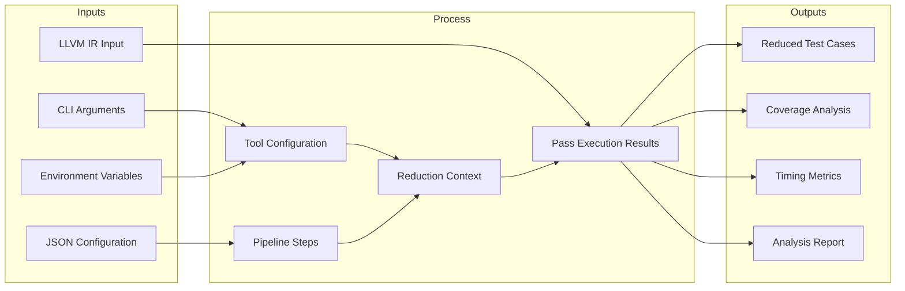

### 2.2 Security Scanning Pipeline

#### 2.2.1 Workflow Description

The Security Scanning Pipeline is a comprehensive security vulnerability scanning workflow that detects security issues in dependencies, infrastructure as code, and GitHub Actions workflows. This workflow integrates multiple security tools (Trivy, Bandit, Gitleaks, Zizmor) to provide complete security coverage for CI/CD pipelines.

**Business Value**: Identifies security vulnerabilities before deployment, ensures compliance with security policies, and prevents security incidents in production environments.

**Entry Point**: `/scripts/github_actions/scan_tools/trivy.py`

**Exit Point**: Consolidated security findings report

#### 2.2.2 Detailed Flow Diagram

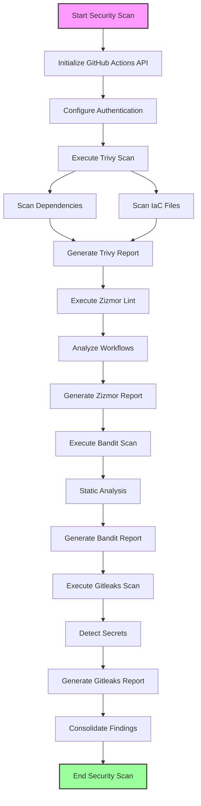

#### 2.2.3 Step-by-Step Process Details

**Step 1: Initialize GitHub Actions API**
- **Code Entry**: `/scripts/github_actions/build_tools/github_actions_api.py`
- **Input**: GitHub token and repository information
- **Output**: GitHub Actions API client instance
- **Logic**:
  - Initialize GitHub Actions API client with authentication
  - Set up workflow commands
  - Configure REST API access
- **Business Value**: Enables CI/CD automation and workflow orchestration

**Step 2: Execute Trivy Scan**
- **Code Entry**: `/scripts/github_actions/scan_tools/trivy.py`
- **Input**: Dependency files and IaC files
- **Output**: Vulnerability findings in SARIF/non-SARIF format
- **Logic**:
  - Execute trivy to scan dependencies
  - Scan infrastructure as code files
  - Support subtree scanning for changed files
  - Generate SARIF/non-SARIF reports
- **Business Value**: Identifies dependency vulnerabilities and IaC security issues

**Step 3: Execute Zizmor Lint**
- **Code Entry**: `/scripts/github_actions/scan_tools/zizmor.py`
- **Input**: GitHub Actions workflow files
- **Output**: Security misconfiguration findings
- **Logic**:
  - Run zizmor to lint GitHub Actions workflows
  - Analyze workflow-specific security issues
  - Tally findings by severity
  - Generate SARIF/non-SARIF reports
- **Business Value**: Detects workflow security misconfigurations

**Step 4: Execute Bandit Scan**
- **Code Entry**: `/scripts/github_actions/scan_tools/bandit.py`
- **Input**: Python source code
- **Output**: Python security issue findings
- **Logic**:
  - Execute bandit security scanner on repository
  - Detect Python security issues through static analysis
  - Support SARIF and non-SARIF report formats
  - Derive change sets from GitHub events
- **Business Value**: Identifies Python code security vulnerabilities

**Step 5: Execute Gitleaks Scan**
- **Code Entry**: `/scripts/github_actions/scan_tools/gitleaks.py`
- **Input**: Codebase and git history
- **Output**: Detected secrets and credentials
- **Logic**:
  - Run gitleaks to detect leaked secrets
  - Scan for hardcoded credentials
  - Support multiple report formats
  - Handle various exit codes for clean runs and findings
- **Business Value**: Prevents credential leakage in code repositories

**Step 6: Consolidate Findings**
- **Code Entry**: Security scanner aggregator
- **Input**: Individual scanner reports
- **Output**: Consolidated security findings by severity
- **Logic**:
  - Aggregate all security findings
  - Categorize by severity (critical, high, medium, low)
  - Generate consolidated report
- **Business Value**: Provides unified security assessment view

#### 2.2.4 Parallel Execution Optimization

The security scanning workflow supports parallel execution of independent scanners:

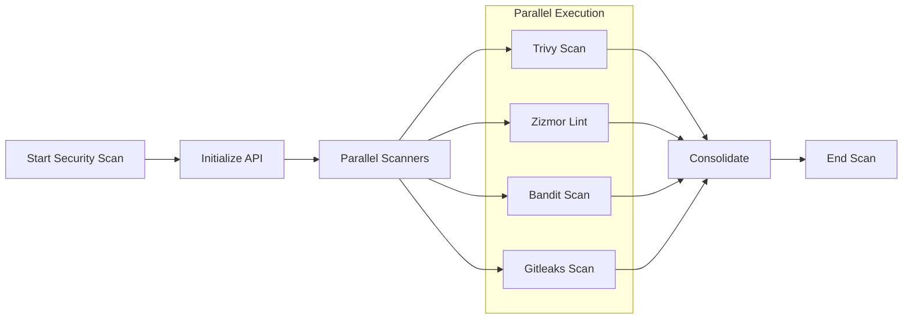

**Performance Impact**: Parallel execution can reduce total scan time by 60-70% compared to sequential execution.

### 2.3 Docker Image Build Pipeline

#### 2.3.1 Workflow Description

The Docker Image Build Pipeline manages package dependencies for different CI/CD stages (builder, runtime, source, release). This workflow ensures proper environment setup for fuzz testing pipelines through automated package installation and image building.

**Business Value**: Ensures consistent and reproducible build environments, reduces build failures due to missing dependencies, and optimizes CI/CD pipeline performance.

**Entry Point**: `/scripts/docker/build-image.sh`

**Exit Point**: Built Docker image ready for deployment

#### 2.3.2 Detailed Flow Diagram

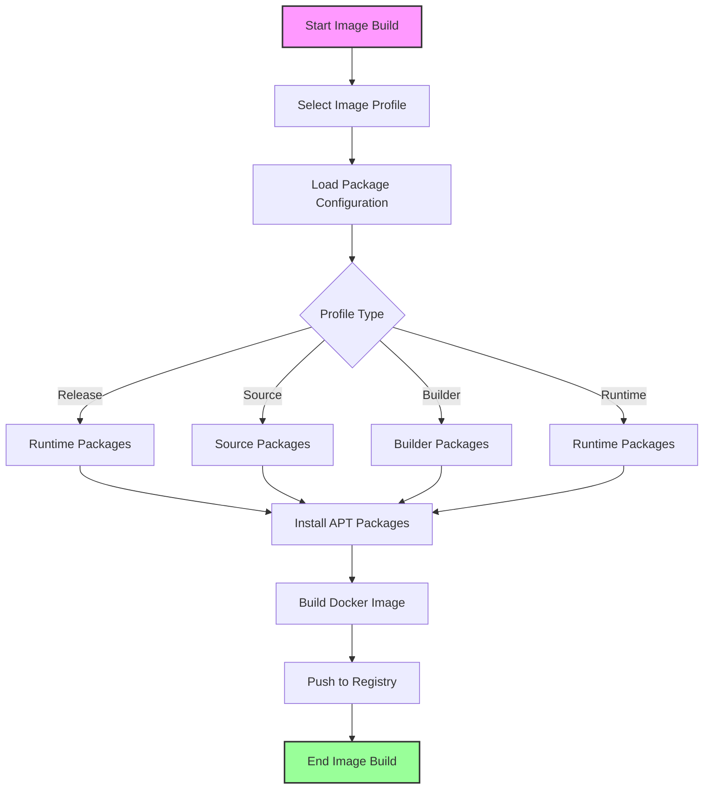

#### 2.3.3 Step-by-Step Process Details

**Step 1: Select Image Profile**
- **Code Entry**: `/scripts/image/apt/runtime.packages`, `/scripts/image/apt/builder.packages`, `/scripts/image/apt/source.packages`, `/scripts/image/apt/release.packages`
- **Input**: Build stage identifier
- **Output**: Selected package configuration
- **Logic**:
  - Choose between release, source, builder, or runtime image profiles
  - Match Dockerfile stages to appropriate profile
- **Business Value**: Optimizes image size and dependencies for specific use cases

**Step 2: Load Package Configuration**
- **Code Entry**: Package configuration files
- **Input**: Image profile identifier
- **Output**: Package list for installation
- **Logic**:
  - Load package requirements from apt configuration files
  - Parse package lists for selected profile
  - Validate package availability
- **Business Value**: Ensures correct dependencies for each build stage

**Step 3: Install APT Packages**
- **Code Entry**: `/scripts/image/install-apt-packages.sh`
- **Input**: Package list
- **Output**: Installed packages
- **Logic**:
  - Execute automated package installation script
  - Install packages matching Dockerfile stages
  - Handle multiple profiles (release, source, builder, runtime)
- **Business Value**: Automates environment setup and reduces manual errors

**Step 4: Build Docker Image**
- **Code Entry**: `/scripts/docker/build-image.sh`
- **Input**: Package installation results
- **Output**: Built Docker image
- **Logic**:
  - Build Docker image using GitHub Actions workflow
  - Apply package configurations
  - Create multi-stage build if needed
- **Business Value**: Creates reproducible and optimized container images

**Step 5: Push to Registry**
- **Code Entry**: GitHub Actions API client
- **Input**: Built Docker image
- **Output**: Image in container registry
- **Logic**:
  - Upload built image to container registry
  - Tag image with appropriate version
  - Update registry metadata
- **Business Value**: Makes images available for CI/CD deployment

### 2.4 Tool Configuration Resolution Pipeline

#### 2.4.1 Workflow Description

The Tool Configuration Resolution Pipeline manages LLVM tool configuration through CLI flags, environment variables, and fallback mechanisms. This workflow ensures proper tool availability and configuration for reduction operations.

**Business Value**: Provides flexible tool configuration, supports multiple deployment scenarios, and ensures tool compatibility across different environments.

**Entry Point**: `/src/fuzz_fill/llvm_tools.py`

**Exit Point**: Tool configuration dataclass instances

#### 2.4.2 Detailed Flow Diagram

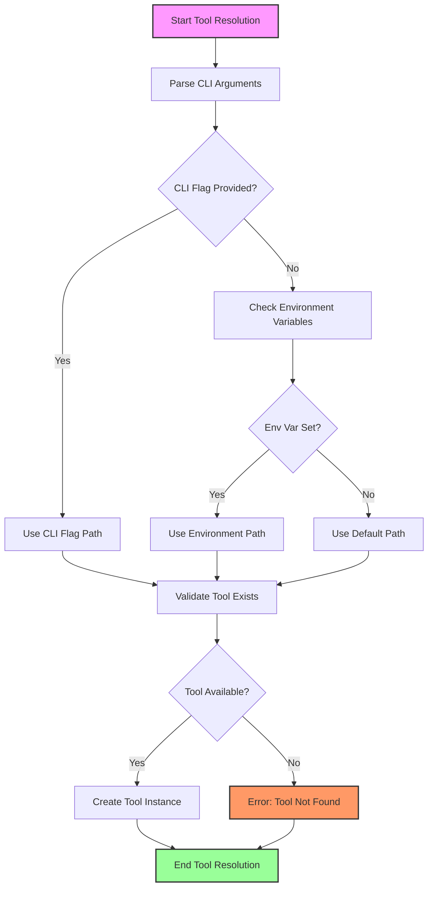

#### 2.4.3 Step-by-Step Process Details

**Step 1: Parse CLI Arguments**
- **Code Entry**: `/src/fuzz_fill/llvm_tools.py`
- **Input**: Command-line arguments
- **Output**: Parsed tool path specifications
- **Logic**:
  - Extract tool path specifications from command-line arguments
  - Parse flags for different tool types
- **Business Value**: Provides explicit tool configuration through CLI

**Step 2: Check Environment Variables**
- **Code Entry**: `/src/fuzz_fill/env.py`
- **Input**: Environment variable names
- **Output**: Environment variable paths
- **Logic**:
  - Fallback to environment variable paths if CLI flags not provided
  - Check for LLVM tool environment variables
- **Business Value**: Supports environment-based configuration for deployment flexibility

**Step 3: Use Default Path**
- **Code Entry**: `/src/fuzz_fill/llvm_tools.py`
- **Input**: None (default values)
- **Output**: Default tool paths
- **Logic**:
  - Apply default tool paths when neither CLI nor env vars specified
  - Use standard LLVM installation paths
- **Business Value**: Provides sensible defaults for common scenarios

**Step 4: Validate Tool Exists**
- **Code Entry**: `/src/fuzz_fill/llvm_tools.py`
- **Input**: Tool path
- **Output**: Validation result
- **Logic**:
  - Verify tool executables are available and accessible
  - Check tool version compatibility
  - Validate tool permissions
- **Business Value**: Ensures tool availability before pipeline execution

**Step 5: Create Tool Instance**
- **Code Entry**: `/src/fuzz_fill/llvm_tools.py`
- **Input**: Validated tool path
- **Output**: Frozen dataclass instance
- **Logic**:
  - Instantiate tool configuration using dataclasses
  - Create BaselineTools, CandidateTestTools, IncrementalTools, or ReduceTools instances
- **Business Value**: Provides typed and validated tool configuration

---

## 3. Flow Coordination and Control

### 3.1 Multi-Module Coordination Mechanisms

#### 3.1.1 Domain Dependency Matrix

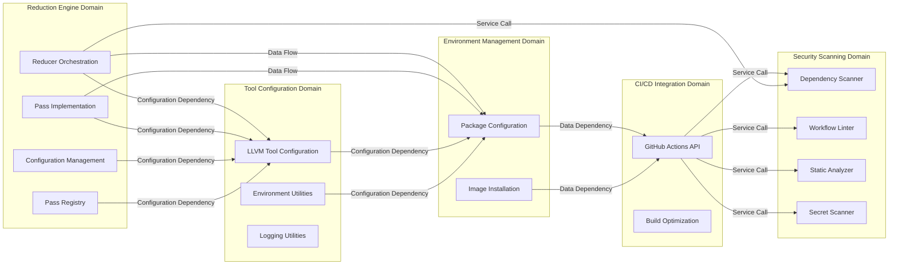

#### 3.1.2 Inter-Module Communication Patterns

| Source Module | Target Module | Communication Type | Data Flow |
|---------------|---------------|-------------------|-----------|
| Reducer | Tool Configuration | Configuration Dependency | Tool paths, environment variables |
| Reducer | Environment Management | Data Flow | Package dependencies, runtime requirements |
| CI/CD Integration | Security Scanning | Service Call | Scan commands, report aggregation |
| Environment Management | CI/CD Integration | Data Dependency | Package lists, image profiles |
| Tool Configuration | Environment Management | Configuration Dependency | Tool availability, package requirements |
| Reducer | Security Scanning | Service Call | Security validation triggers |

### 3.2 State Management and Synchronization

#### 3.2.1 Reduction Context State Machine

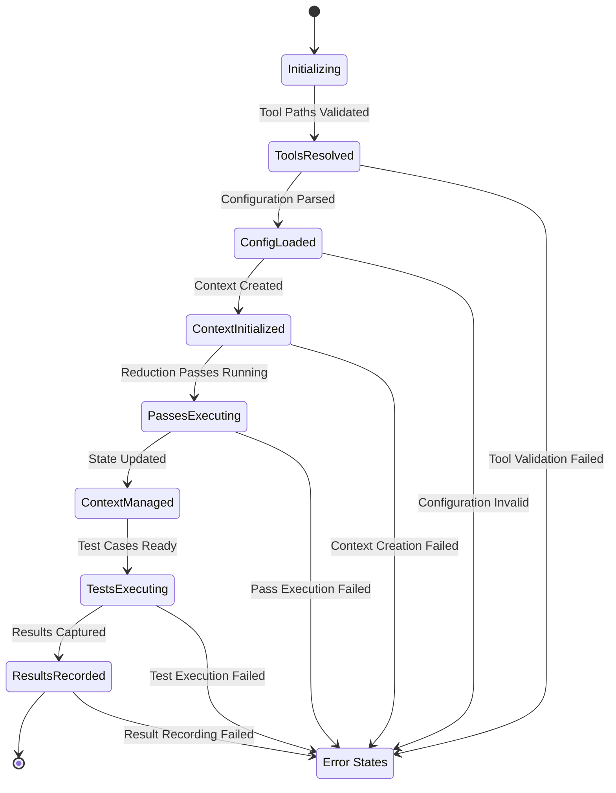

#### 3.2.2 State Transition Rules

| Current State | Trigger Event | Next State | Conditions |
|---------------|---------------|------------|------------|
| Initializing | Tool paths validated | ToolsResolved | All tools exist and accessible |
| ToolsResolved | Configuration parsed | ConfigLoaded | JSON valid, steps defined |
| ConfigLoaded | Context created | ContextInitialized | ReduceContext instantiated |
| ContextInitialized | Passes executing | PassesExecuting | All passes queued |
| PassesExecuting | State updated | ContextManaged | Pass results recorded |
| ContextManaged | Tests ready | TestsExecuting | Reduced tests available |
| TestsExecuting | Results captured | ResultsRecorded | All tests completed |
| Any State | Error detected | Error States | Exception thrown |

### 3.3 Data Passing and Sharing

#### 3.3.1 Data Flow Architecture

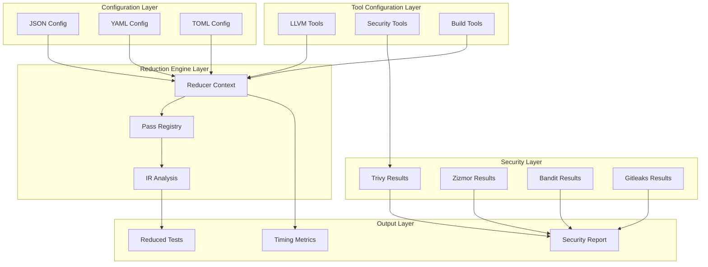

#### 3.3.2 Shared Data Structures

| Data Structure | Owner | Shared With | Purpose |
|----------------|-------|-------------|---------|
| ReduceContext | Reducer | All Reduction Passes | State management |
| ToolConfiguration | Tool Config | Reducer | Tool paths and settings |
| PipelineSteps | Config | Reducer | Execution sequence |
| SecurityFindings | Security Scanners | CI/CD Integration | Report aggregation |
| PackageList | Environment | CI/CD Integration | Dependency management |

### 3.4 Execution Control and Scheduling

#### 3.4.1 Pipeline Execution Control

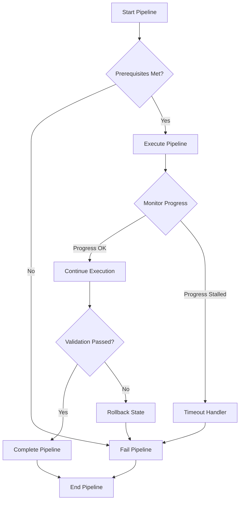

#### 3.4.2 Scheduling Strategies

| Strategy | Use Case | Implementation |
|----------|----------|----------------|
| Sequential | Reduction passes | Pipeline step ordering |
| Parallel | Security scanners | Independent tool execution |
| Lazy Loading | Pass registry | On-demand pass loading |
| Caching | Tool resolution | Path resolution cache |
| Retry | Transient failures | Exponential backoff |

---

## 4. Exception Handling and Recovery

### 4.1 Error Detection and Handling

#### 4.1.1 Error Classification

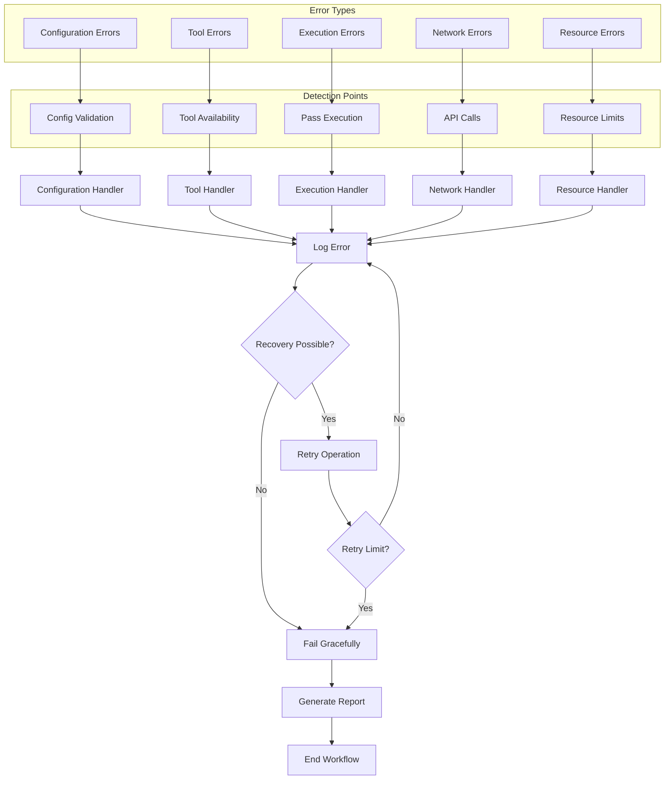

#### 4.1.2 Error Handling Strategies

| Error Type | Detection Point | Handling Strategy | Recovery Action |
|------------|-----------------|-------------------|-----------------|
| Configuration Errors | Config validation | Validation error | Prompt user, abort |
| Tool Errors | Tool availability check | Tool not found | Suggest installation, abort |
| Execution Errors | Pass execution | Pass failure | Skip pass, continue |
| Network Errors | API calls | Connection timeout | Retry with backoff |
| Resource Errors | Resource limits | Memory/CPU exceeded | Reduce parallelism |

### 4.2 Exception Recovery Mechanisms

#### 4.2.1 Reduction Pipeline Recovery

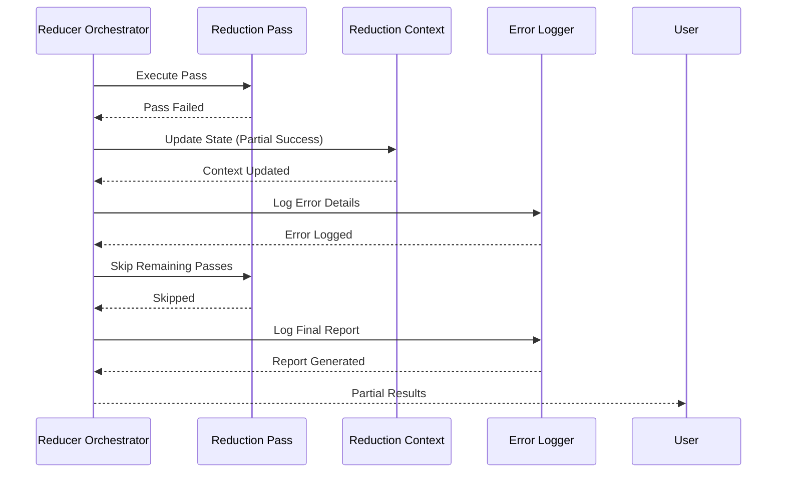

#### 4.2.2 Security Scanner Recovery

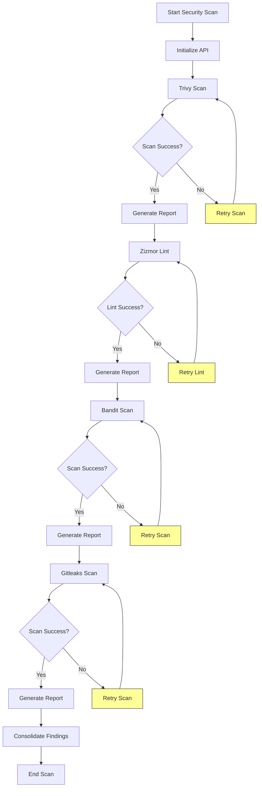

### 4.3 Fault Tolerance Strategy Design

#### 4.3.1 Fault Tolerance Layers

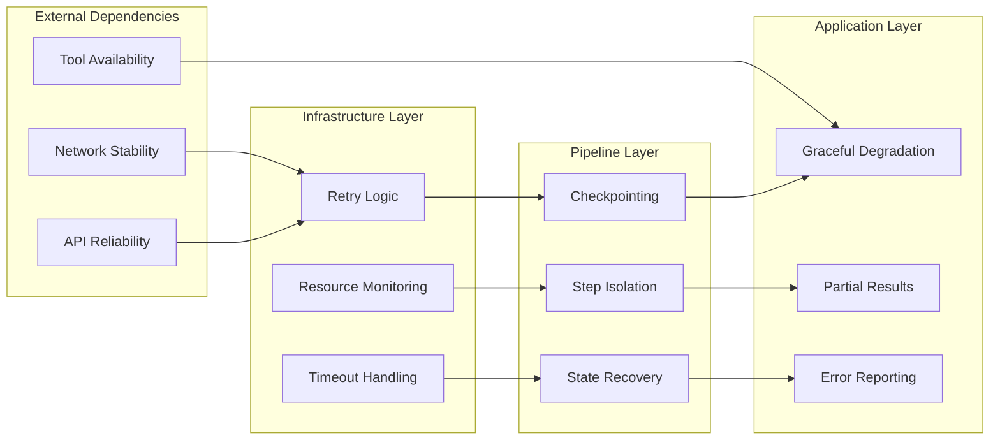

#### 4.3.2 Fault Tolerance Metrics

| Metric | Target | Measurement |
|--------|--------|-------------|
| Error Recovery Rate | >95% | Recovery attempts / Total errors |
| Partial Completion Rate | >80% | Partial results / Failed runs |
| Mean Time to Recovery | <5 min | Recovery time / Failure count |
| Resource Utilization | <80% | Peak usage / Capacity |

### 4.4 Failure Retry and Degradation

#### 4.4.1 Retry Strategy

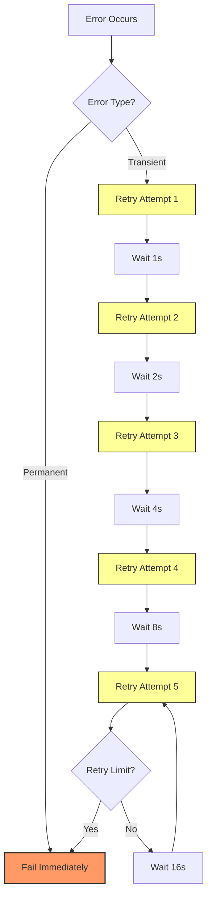

#### 4.4.2 Degradation Modes

| Mode | Trigger | Behavior | Impact |
|------|---------|----------|--------|
| Full Mode | All systems operational | Complete workflow | No impact |
| Reduced Mode | Minor failures | Skip non-critical steps | Reduced functionality |
| Minimal Mode | Major failures | Execute core operations only | Limited functionality |
| Fail Mode | Critical failures | Abort with error report | No output |

---

## 5. Key Process Implementation

### 5.1 Core Algorithm Processes

#### 5.1.1 Reduction Pass Implementation

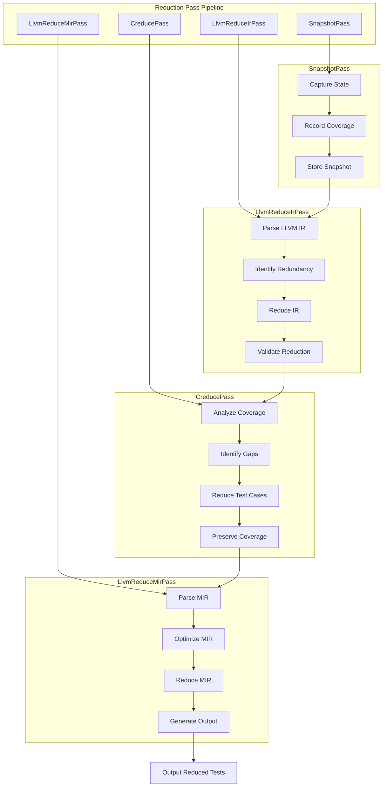

#### 5.1.2 Reduction Algorithm Details

**SnapshotPass Algorithm:**
```python
def snapshot_pass(ir, context):
    """Capture current state snapshot for reduction baseline."""
    snapshot = {
        'ir': ir,
        'coverage': get_coverage(ir),
        'timestamp': datetime.now(),
        'metadata': context.metadata
    }
    context.snapshots.append(snapshot)
    return snapshot
```

**LlvmReduceIrPass Algorithm:**
```python
def llvm_reduce_ir_pass(ir, context):
    """Reduce LLVM IR to eliminate redundancy."""
    # Parse and analyze LLVM IR
    parsed_ir = parse_llvm_ir(ir)
    
    # Identify redundant instructions
    redundant = identify_redundancy(parsed_ir)
    
    # Remove redundant instructions
    reduced_ir = remove_redundancy(parsed_ir, redundant)
    
    # Validate reduction preserves semantics
    validated = validate_reduction(reduced_ir, ir)
    
    return reduced_ir if validated else ir
```

**CreducePass Algorithm:**
```python
def creduce_pass(ir, context):
    """Perform coverage-based reduction."""
    # Analyze coverage gaps
    gaps = analyze_coverage_gaps(ir)
    
    # Identify test cases covering gaps
    test_cases = identify_test_cases(ir, gaps)
    
    # Reduce test cases while preserving coverage
    reduced_tests = reduce_test_cases(test_cases, gaps)
    
    # Verify coverage preservation
    preserved = verify_coverage_preservation(reduced_tests, gaps)
    
    return reduced_tests if preserved else test_cases
```

**LlvmReduceMirPass Algorithm:**
```python
def llvm_reduce_mir_pass(ir, context):
    """Reduce LLVM MIR for further optimization."""
    # Parse MIR representation
    parsed_mir = parse_mir(ir)
    
    # Optimize MIR structure
    optimized_mir = optimize_mir(parsed_mir)
    
    # Reduce MIR complexity
    reduced_mir = reduce_mir_complexity(optimized_mir)
    
    # Generate output
    output = generate_output(reduced_mir)
    
    return output
```

### 5.2 Data Processing Pipelines

#### 5.2.1 LLVM IR Processing Pipeline

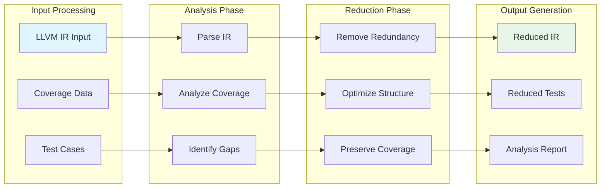

#### 5.2.2 Security Scanning Pipeline

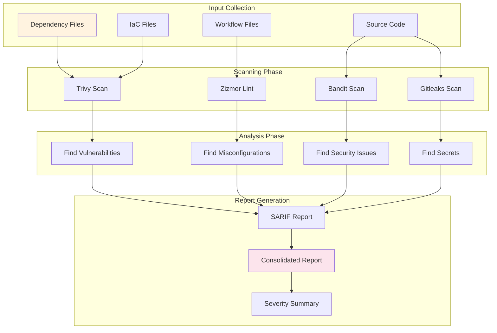

### 5.3 Business Rule Execution

#### 5.3.1 Reduction Business Rules

| Rule ID | Rule Description | Priority | Implementation |
|---------|------------------|----------|----------------|
| R001 | Preserve coverage for all test cases | High | Coverage verification in CreducePass |
| R002 | Eliminate redundant instructions | Medium | Redundancy detection in LlvmReduceIrPass |
| R003 | Optimize MIR structure | Medium | MIR optimization in LlvmReduceMirPass |
| R004 | Validate reduction semantics | High | Semantic validation in all passes |
| R005 | Log all reduction steps | Medium | Logging in all pass implementations |

#### 5.3.2 Security Scanning Business Rules

| Rule ID | Rule Description | Priority | Implementation |
|---------|------------------|----------|----------------|
| S001 | Block critical vulnerabilities | Critical | Trivy scan with severity filtering |
| S002 | Flag high-severity misconfigurations | High | Zizmor lint with severity thresholds |
| S003 | Detect all hardcoded secrets | Critical | Gitleaks scan with pattern matching |
| S004 | Report Python security issues | Medium | Bandit scan with rule set |
| S005 | Aggregate findings by severity | High | Report consolidation logic |

### 5.4 Technical Implementation Details

#### 5.4.1 Configuration Management Implementation

```python
# /src/reduce/config.py
from dataclasses import dataclass
from typing import List, Dict, Any
import json

@dataclass
class PipelineStep:
    """Represents a single step in the reduction pipeline."""
    name: str
    type: str
    config: Dict[str, Any]
    dependencies: List[str]
    timeout: int = 300

@dataclass
class ReductionConfig:
    """Main reduction configuration object."""
    pipeline_steps: List[PipelineStep]
    tool_paths: Dict[str, str]
    coverage_threshold: float = 0.95
    max_iterations: int = 100
    output_dir: str = "./reduced_tests"
    
    @classmethod
    def from_file(cls, path: str) -> 'ReductionConfig':
        """Load configuration from JSON file."""
        with open(path, 'r') as f:
            data = json.load(f)
            return cls(**data)
```

#### 5.4.2 Tool Configuration Implementation

```python
# /src/fuzz_fill/llvm_tools.py
from dataclasses import dataclass, field
from typing import Optional
from enum import Enum

class ToolType(Enum):
    BASELINE = "baseline"
    CANDIDATE = "candidate"
    INCREMENTAL = "incremental"
    REDUCE = "reduce"

@dataclass(frozen=True)
class LLVMToolConfig:
    """Base class for LLVM tool configuration."""
    tool_type: ToolType
    path: str
    version: Optional[str] = None
    
    @classmethod
    def from_cli(cls, tool_type: ToolType, path: str) -> 'LLVMToolConfig':
        """Create tool config from CLI argument."""
        return cls(tool_type=tool_type, path=path)
    
    @classmethod
    def from_env(cls, tool_type: ToolType, env_var: str) -> 'LLVMToolConfig':
        """Create tool config from environment variable."""
        path = os.environ.get(env_var)
        if not path:
            raise ValueError(f"Environment variable {env_var} not set")
        return cls(tool_type=tool_type, path=path)

@dataclass(frozen=True)
class ReduceTools:
    """Complete tool configuration for reduction operations."""
    llvm: LLVMToolConfig
    clang: LLVMToolConfig
    opt: LLVMToolConfig
    llc: LLVMToolConfig
    filecheck: LLVMToolConfig
```

#### 5.4.3 Reduction Context Implementation

```python
# /src/reduce/reducer.py
from dataclasses import dataclass, field
from typing import Dict, List, Optional
from datetime import datetime

@dataclass
class ReduceContext:
    """Manages reduction state and execution flow."""
    pipeline_steps: List[Dict]
    tool_config: Dict
    snapshots: List[Dict] = field(default_factory=list)
    current_step: int = 0
    is_running: bool = False
    error_state: Optional[str] = None
    start_time: Optional[datetime] = None
    end_time: Optional[datetime] = None
    
    def initialize(self):
        """Initialize reduction context."""
        self.start_time = datetime.now()
        self.is_running = True
        self.error_state = None
    
    def execute_step(self, step_name: str) -> bool:
        """Execute a pipeline step."""
        if self.error_state:
            return False
        
        self.current_step += 1
        try:
            # Execute step logic
            result = self._execute_step_impl(step_name)
            self.snapshots.append({
                'step': step_name,
                'timestamp': datetime.now(),
                'result': result
            })
            return True
        except Exception as e:
            self.error_state = str(e)
            self.is_running = False
            return False
    
    def get_report(self) -> Dict:
        """Generate execution report."""
        return {
            'start_time': self.start_time.isoformat() if self.start_time else None,
            'end_time': self.end_time.isoformat() if self.end_time else None,
            'current_step': self.current_step,
            'total_steps': len(self.pipeline_steps),
            'snapshots_count': len(self.snapshots),
            'error_state': self.error_state,
            'is_running': self.is_running
        }
```

#### 5.4.4 Security Scanner Implementation

```python
# /scripts/github_actions/scan_tools/trivy.py
import subprocess
import json
import os
from typing import Dict, List, Optional

class TrivyScanner:
    """Vulnerability scanner using Trivy."""
    
    def __init__(self, config_path: str = "trivy.yaml"):
        self.config_path = config_path
        self.findings = []
        self.sarif_output = None
    
    def scan_dependencies(self, target: str) -> Dict:
        """Scan dependencies for vulnerabilities."""
        cmd = [
            "trivy", "fs", target,
            "--format", "json",
            "--severity", "CRITICAL,HIGH"
        ]
        
        result = subprocess.run(cmd, capture_output=True, text=True)
        if result.returncode == 0:
            self.findings = json.loads(result.stdout)
        return self._generate_report()
    
    def scan_iac(self, target: str) -> Dict:
        """Scan infrastructure as code for vulnerabilities."""
        cmd = [
            "trivy", "config", target,
            "--format", "json",
            "--severity", "CRITICAL,HIGH"
        ]
        
        result = subprocess.run(cmd, capture_output=True, text=True)
        if result.returncode == 0:
            self.findings = json.loads(result.stdout)
        return self._generate_report()
    
    def _generate_report(self) -> Dict:
        """Generate SARIF report from findings."""
        sarif = {
            "version": "2.1.0",
            "runs": [{
                "results": self._convert_to_sarif(self.findings)
            }]
        }
        self.sarif_output = json.dumps(sarif, indent=2)
        return sarif
    
    def _convert_to_sarif(self, findings: List) -> List:
        """Convert Trivy findings to SARIF format."""
        sarif_results = []
        for finding in findings:
            sarif_results.append({
                "ruleId": finding.get("VulnerabilityID", "unknown"),
                "message": {
                    "text": finding.get("Description", "No description")
                },
                "locations": [{
                    "physicalLocation": {
                        "artifactLocation": {
                            "uri": finding.get("Path", "unknown")
                        }
                    }
                }],
                "severity": finding.get("Severity", "unknown")
            })
        return sarif_results
```

#### 5.4.5 Performance Optimization Implementation

```python
# /src/reduce/utils.py
import time
import logging
from typing import Dict, List, Optional

class PerformanceTracker:
    """Track and record performance metrics."""
    
    def __init__(self, logger: logging.Logger):
        self.logger = logger
        self.timings: Dict[str, float] = {}
    
    def start(self, operation: str):
        """Start timing for an operation."""
        self.timings[operation] = time.time()
        self.logger.info(f"Started: {operation}")
    
    def stop(self, operation: str) -> float:
        """Stop timing and return duration."""
        if operation in self.timings:
            duration = time.time() - self.timings[operation]
            self.timings[operation] = duration
            self.logger.info(f"Completed: {operation} in {duration:.3f}s")
            return duration
        return 0.0
    
    def get_report(self) -> Dict:
        """Get performance report."""
        return {
            operation: {
                'duration': duration,
                'unit': 'seconds'
            }
            for operation, duration in self.timings.items()
        }

class CacheManager:
    """Manage caching for tool resolution and configuration."""
    
    def __init__(self, max_size: int = 100):
        self.cache: Dict[str, Any] = {}
        self.max_size = max_size
    
    def get(self, key: str) -> Optional[Any]:
        """Get cached value."""
        return self.cache.get(key)
    
    def set(self, key: str, value: Any):
        """Set cached value."""
        if len(self.cache) >= self.max_size:
            # Evict oldest entry
            oldest_key = next(iter(self.cache))
            del self.cache[oldest_key]
        self.cache[key] = value
    
    def clear(self):
        """Clear all cached values."""
        self.cache.clear()
```

### 5.5 Implementation Best Practices

#### 5.5.1 Code Quality Guidelines

1. **Type Safety**: Use dataclasses with frozen=True for immutable configurations
2. **Error Handling**: Implement try-except blocks with specific exception types
3. **Logging**: Use structured logging with context information
4. **Documentation**: Add docstrings to all public functions and classes