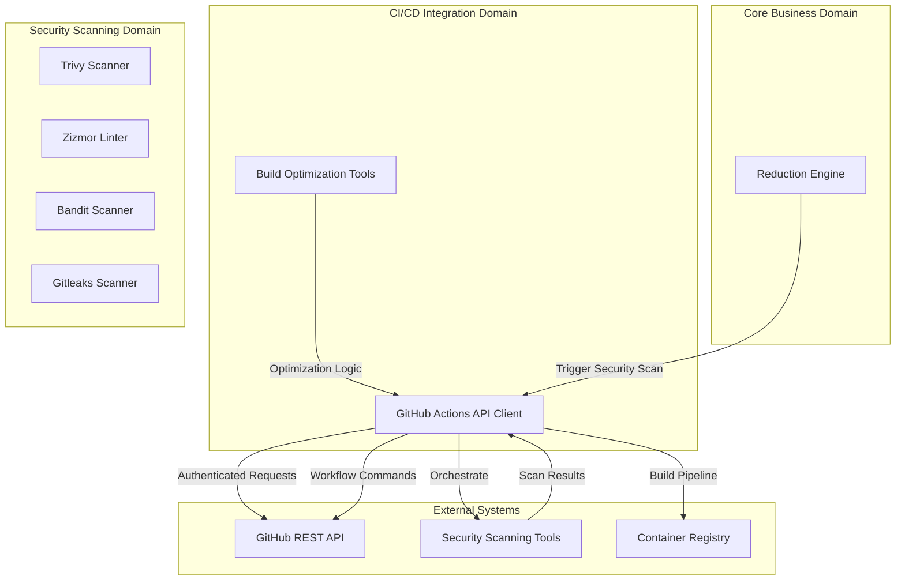
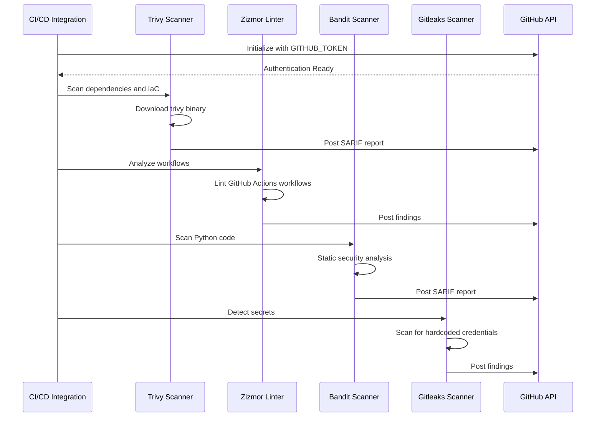
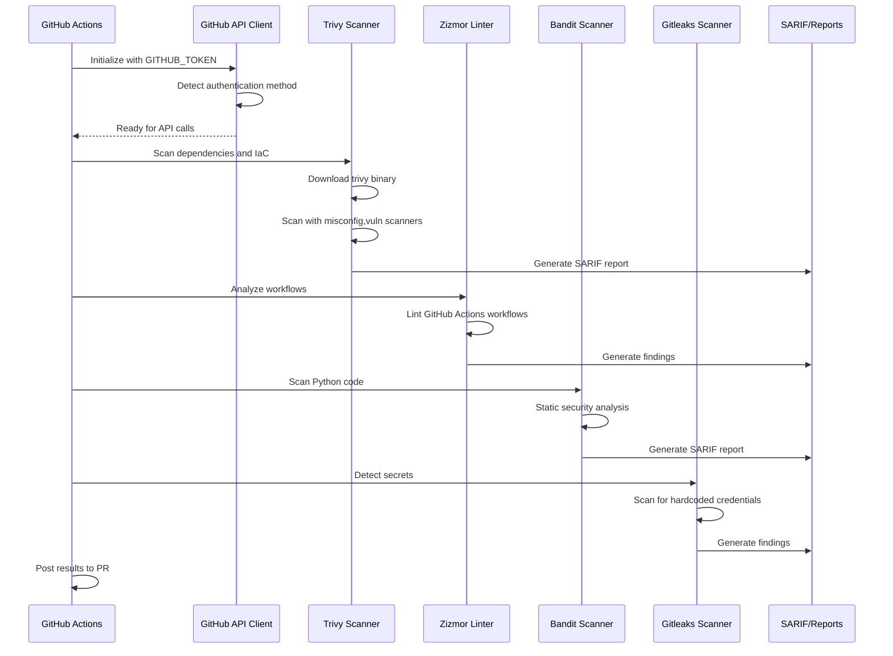
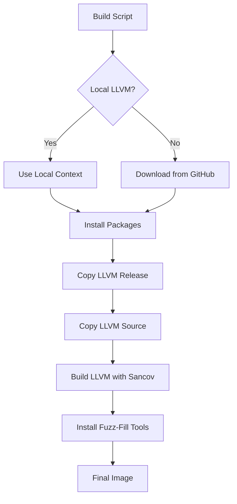
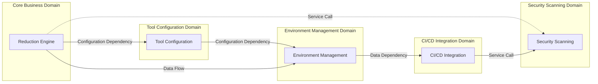

# CI/CD Integration Domain Technical Documentation

## 1. Domain Overview

The **CI/CD Integration Domain** serves as the orchestration layer for automated build, deployment, and security scanning workflows within the fuzz-fill infrastructure. This domain bridges the gap between core business logic (reduction engine) and external systems (GitHub Actions, container registries, security tools), enabling seamless integration of fuzz testing pipelines into continuous integration and delivery workflows.

### 1.1 Domain Responsibilities

| Responsibility | Description |
|---------------|-------------|
| **GitHub Actions API Integration** | Abstracts GitHub REST API interactions for workflow automation and data retrieval |
| **Build Optimization** | Computes optimal fetch-depth parameters for GitHub Actions checkout operations |
| **Workflow Command Abstraction** | Provides helper functions for setting outputs and environment variables within GitHub Actions |
| **Security Scanning Orchestration** | Coordinates execution of security scanning tools (Trivy, Bandit, Gitleaks, Zizmor) |
| **Docker Build Automation** | Manages Docker image creation workflows through GitHub Actions |

### 1.2 Domain Importance Metrics

- **Importance Score**: 7.0/10
- **Complexity Score**: 6.0/10
- **Architecture Confidence**: 8.5/10

---

## 2. Architecture Design

### 2.1 High-Level Architecture



### 2.2 Design Principles

1. **API Abstraction Layer**: All GitHub API interactions are abstracted through a unified client interface
2. **Authentication Agnostic**: Supports multiple authentication methods with automatic fallback
3. **Workflow Command Helpers**: Provides standardized functions for GitHub Actions workflow communication
4. **Rate Limit Awareness**: Implements rate limit handling for API operations
5. **Security-First Design**: URL validation and secure credential handling

### 2.3 Key Architectural Patterns

#### 2.3.1 Dependency Injection Pattern

```python
# Tool paths injected rather than created internally
class GitHubAPI:
    def __init__(self, auth_method: AuthMethod = AuthMethod.GITHUB_TOKEN):
        # Dependencies injected, not created internally
        self._auth_method = auth_method
        self._client = self._create_client(auth_method)
```

#### 2.3.2 Factory Pattern for Authentication

```python
class AuthMethod(Enum):
    GITHUB_TOKEN = auto()   # CI environment
    GH_CLI = auto()         # Local development
    UNAUTHENTICATED = auto()  # Fallback

def _create_client(auth_method: AuthMethod) -> GitHubAPI:
    """Factory method for creating authenticated API clients"""
    if auth_method == AuthMethod.GITHUB_TOKEN:
        return GitHubAPIClient(token=os.environ.get("GITHUB_TOKEN"))
    elif auth_method == AuthMethod.GH_CLI:
        return GitHubAPIClient(cli=True)
    else:
        return GitHubAPIClient(unauthenticated=True)
```

#### 2.3.3 Context Management Pattern

```python
@contextmanager
def record_log_timings() -> Iterator[list[tuple[str, float]]]:
    """Enable CSV export for nested log_timing blocks"""
    global _active_timings
    rows: list[tuple[str, float]] = []
    with _timings_lock:
        _active_timings = rows
    try:
        yield rows
    finally:
        with _timings_lock:
            _active_timings = None
```

---

## 3. Component Architecture

### 3.1 GitHub Actions API Client

**File Location**: `scripts/github_actions/build_tools/github_actions_api.py`

**Purpose**: Comprehensive GitHub Actions API client library providing workflow commands, REST API access, and authentication handling.

#### 3.1.1 Core Features

| Feature | Description |
|---------|-------------|
| **Authentication Detection** | Automatic detection of GITHUB_TOKEN, gh CLI, or unauthenticated mode |
| **Workflow Commands** | Helper functions for gha_set_output, gha_set_env, gha_set_header |
| **REST API Access** | Generic request wrapper for GitHub REST API |
| **Query Functions** | Functions for fetching workflow runs, commits, and repository data |
| **Rate Limit Handling** | Automatic handling of GitHub API rate limits |
| **URL Security** | Validates URL schemes to prevent file:// and other unsafe schemes |

#### 3.1.2 Authentication Methods

```python
class AuthMethod(Enum):
    GITHUB_TOKEN = auto()   # CI environment with GITHUB_TOKEN
    GH_CLI = auto()         # Local development with gh CLI
    UNAUTHENTICATED = auto()  # Fallback for unauthenticated requests
```

**Authentication Flow**:
1. Check for `GITHUB_TOKEN` environment variable (CI environment)
2. Fall back to `gh` CLI if installed and authenticated (local development)
3. Use unauthenticated requests as last resort (rate limited)

#### 3.1.3 Workflow Command Helpers

```python
def gha_set_output(name: str, value: str, *, timeout: int = 30) -> None:
    """Set an output for the current GitHub Actions workflow"""
    # Implementation: Writes to $GITHUB_OUTPUT file
    
def gha_set_env(name: str, value: str, *, timeout: int = 30) -> None:
    """Set an environment variable for the current workflow"""
    # Implementation: Writes to $GITHUB_ENV file
    
def gha_set_header(name: str, value: str, *, timeout: int = 30) -> None:
    """Set a header for the current workflow"""
    # Implementation: Writes to $GITHUB_OUTPUT file
```

#### 3.1.4 URL Security Implementation

```python
_ALLOWED_URL_SCHEMES = frozenset({"https"})

def gha_open_https_url(url: str, *, timeout: int, headers: Mapping[str, str] | None = None) -> None:
    """Open an HTTPS URL, rejecting file:// and other schemes"""
    parsed = urlparse(url)
    if parsed.scheme not in _ALLOWED_URL_SCHEMES:
        raise ValueError(f"Refusing to fetch URL with unsupported scheme {parsed.scheme!r}")
    return urlopen(Request(url, headers=headers or {}), timeout=timeout)
```

**Security Rationale**: Prevents execution of local file operations and restricts to HTTPS-only URLs to avoid man-in-the-middle attacks.

### 3.2 Build Optimization Tools

**File Location**: `scripts/github_actions/build_tools/compute_pr_depth.py`

**Purpose**: CLI utilities for optimizing GitHub Actions checkout fetch-depth based on pull request commit history to improve build performance.

#### 3.2.1 Fetch-Depth Computation

```python
def compute_pr_depth(repo: str, pr_number: int) -> int:
    """
    Compute optimal fetch-depth for a pull request based on commit history.
    
    Args:
        repo: Repository identifier (owner/repo)
        pr_number: Pull request number
        
    Returns:
        Optimal fetch-depth value
    """
    # Implementation: Fetches PR commit history and computes optimal depth
    pass
```

**Optimization Strategy**:
- Analyzes pull request commit history
- Determines minimum required fetch-depth to include all necessary commits
- Reduces network bandwidth and build time by fetching only required history

#### 3.2.2 CLI Interface

```bash
# Compute fetch-depth for a specific PR
python compute_pr_depth.py --repo owner/repo --pr 123

# Compute fetch-depth for current PR
python compute_pr_depth.py --repo owner/repo
```

---

## 4. Implementation Details

### 4.1 GitHubAPI Class Structure

```python
class GitHubAPI:
    """Client for making GitHub API requests"""
    
    class AuthMethod(Enum):
        GITHUB_TOKEN = auto()   # CI environment
        GH_CLI = auto()         # Local development
        UNAUTHENTICATED = auto()  # Fallback
    
    def __init__(self):
        # Detect and cache authentication method
        # Initialize appropriate client
    
    def send_request(self, url: str) -> dict:
        """Send authenticated GitHub API request"""
        pass
    
    def gha_set_output(self, name: str, value: str) -> None:
        """Set workflow output"""
        pass
    
    def gha_set_env(self, name: str, value: str) -> None:
        """Set workflow environment variable"""
        pass
    
    def gha_set_header(self, name: str, value: str) -> None:
        """Set workflow header"""
        pass
    
    def get_workflow_runs(self, repo: str, branch: str) -> list:
        """Fetch workflow runs for a repository and branch"""
        pass
    
    def get_commit(self, repo: str, sha: str) -> dict:
        """Fetch commit details"""
        pass
```

### 4.2 Authentication Detection Logic

```python
def detect_auth_method() -> AuthMethod:
    """Detect available authentication method"""
    # Priority 1: GITHUB_TOKEN environment variable
    token = os.environ.get("GITHUB_TOKEN")
    if token:
        return AuthMethod.GITHUB_TOKEN
    
    # Priority 2: gh CLI
    if shutil.which("gh"):
        try:
            gh_auth_status = subprocess.run(
                ["gh", "auth", "status"],
                capture_output=True,
                text=True,
                check=True
            )
            if "logged in" in gh_auth_status.stdout:
                return AuthMethod.GH_CLI
        except subprocess.CalledProcessError:
            pass
    
    # Priority 3: Unauthenticated
    return AuthMethod.UNAUTHENTICATED
```

### 4.3 Rate Limit Handling

```python
class RateLimitExceeded(Exception):
    """Raised when GitHub API rate limit is exceeded"""
    pass

def send_request_with_retry(url: str, max_retries: int = 3) -> dict:
    """Send request with rate limit handling"""
    for attempt in range(max_retries):
        response = requests.get(url)
        
        if response.status_code == 403:
            if "rate limit" in response.text.lower():
                remaining = response.headers.get("X-RateLimit-Remaining", 0)
                reset = response.headers.get("X-RateLimit-Reset", 0)
                raise RateLimitExceeded(
                    f"Rate limit exceeded. Remaining: {remaining}, Reset: {reset}"
                )
        
        if response.status_code == 200:
            return response.json()
        
        time.sleep(2 ** attempt)  # Exponential backoff
    
    raise Exception("Max retries exceeded")
```

---

## 5. Integration Points

### 5.1 Security Scanning Domain Integration

**Relationship Type**: Service Call (Strength: 8.0)

The CI/CD Integration Domain orchestrates security scanning tools through GitHub Actions API:



**Integration Pattern**:
1. Initialize GitHub API client with authentication
2. Execute security scanning tools as subprocesses
3. Collect and consolidate findings
4. Post results to GitHub Actions workflow

### 5.2 Reduction Engine Integration

**Relationship Type**: Service Call (Strength: 5.0)

The Reduction Engine may trigger security scanning as part of CI/CD pipeline integration:

```python
# From reducer.py
class Reducer:
    def __init__(self, tools: ReduceTools, output_dir: Path, test: Test,
                 pipeline_steps: tuple[PipelineStep, ...]):
        self.tools = tools
        self.output_dir = output_dir
        self.test = test
        self._pipeline_steps = pipeline_steps
    
    def reduce(self) -> Test:
        # Execute pipeline steps
        # Optionally trigger security scan
        if self._should_run_security_scan():
            github_api = GitHubAPI()
            github_api.trigger_security_scan(self.output_dir)
```

### 5.3 Environment Management Integration

**Relationship Type**: Data Dependency (Strength: 7.0)

CI/CD Integration uses package configurations from Environment Management for Docker image building:

```python
# From github_actions_api.py
def build_docker_image(profile: str, repo: str) -> None:
    """Build Docker image using GitHub Actions workflow"""
    # Load package configuration
    package_config = load_package_config(profile)
    
    # Build image with GitHub Actions
    github_api = GitHubAPI()
    github_api.run_workflow(
        repo,
        "build-image",
        inputs={
            "profile": profile,
            "packages": package_config
        }
    )
```

---

## 6. Business Flows

### 6.1 Security Scanning Flow

**Importance**: 8.0/10



**Key Steps**:
1. **Authentication**: Initialize GitHub API client with token
2. **Dependency Scanning**: Trivy scans for CVEs and misconfigurations
3. **Workflow Linting**: Zizmor analyzes GitHub Actions workflows
4. **Static Analysis**: Bandit detects Python security issues
5. **Secret Detection**: Gitleaks finds hardcoded credentials
6. **Report Generation**: SARIF and other formats for CI integration

### 6.2 Docker Image Build Flow

**Importance**: 7.0/10



**Key Steps**:
1. **Package Installation**: Install APT packages based on profile
2. **LLVM Download**: Download pre-built release or full source
3. **LLVM Build**: Build LLVM with SanitizerCoverage instrumentation
4. **Tool Installation**: Install fuzz-fill and LLVM tools
5. **Image Finalization**: Create final Docker image

---

## 7. Security Architecture

### 7.1 Authentication Security

```python
class AuthMethod(Enum):
    GITHUB_TOKEN = auto()   # CI environment
    GH_CLI = auto()         # Local development
    UNAUTHENTICATED = auto()  # Fallback
```

**Authentication Flow**:
1. Check for `GITHUB_TOKEN` environment variable (CI environment)
2. Fall back to `gh` CLI if installed and authenticated (local development)
3. Use unauthenticated requests as last resort (rate limited)

### 7.2 URL Security

```python
_ALLOWED_URL_SCHEMES = frozenset({"https"})

def gha_open_https_url(url: str, *, timeout: int, headers: Mapping[str, str] | None = None):
    """Open an HTTPS URL, rejecting file:// and other schemes"""
    parsed = urlparse(url)
    if parsed.scheme not in _ALLOWED_URL_SCHEMES:
        raise ValueError(f"Refusing to fetch URL with unsupported scheme {parsed.scheme!r}")
    return urlopen(Request(url, headers=headers or {}), timeout=timeout)
```

**Security Rationale**: Prevents execution of local file operations and restricts to HTTPS-only URLs to avoid man-in-the-middle attacks.

### 7.3 External Tool Security

| Tool | Purpose | Exit Codes |
|------|---------|------------|
| Trivy | Dependency & IaC scanning | 0=clean, 1=findings, 2=error |
| Zizmor | Workflow security linting | 0=clean, 1=findings |
| Bandit | Python static analysis | 0=clean, 1=findings |
| Gitleaks | Secret detection | 0=clean, 1=findings |

---

## 8. Performance Considerations

### 8.1 Build Optimization

- **Fetch-depth computation**: Optimizes GitHub Actions checkout based on PR history
- **Layer caching**: Docker build uses layer caching for repeated builds
- **Parallel builds**: Ninja parallel jobs for LLVM compilation

### 8.2 API Rate Limit Management

```python
def send_request_with_retry(url: str, max_retries: int = 3) -> dict:
    """Send request with rate limit handling"""
    for attempt in range(max_retries):
        response = requests.get(url)
        
        if response.status_code == 403:
            if "rate limit" in response.text.lower():
                remaining = response.headers.get("X-RateLimit-Remaining", 0)
                reset = response.headers.get("X-RateLimit-Reset", 0)
                raise RateLimitExceeded(
                    f"Rate limit exceeded. Remaining: {remaining}, Reset: {reset}"
                )
        
        if response.status_code == 200:
            return response.json()
        
        time.sleep(2 ** attempt)  # Exponential backoff
    
    raise Exception("Max retries exceeded")
```

### 8.3 Reduction Performance

- **Intermediate file management**: Ordered temporary files for pipeline steps
- **Lazy loading**: Pass registry avoids unnecessary imports
- **Context isolation**: Per-run context prevents state leakage

---

## 9. Domain Relationships



**Relationship Strengths**:
- **Reduction Engine → Tool Configuration**: 9.0 (Critical dependency)
- **Reduction Engine → Security Scanning**: 5.0 (Optional service call)
- **CI/CD Integration → Security Scanning**: 8.0 (Strong orchestration)
- **Environment Management → CI/CD Integration**: 7.0 (Data dependency)
- **Tool Configuration → Environment Management**: 6.0 (Configuration dependency)
- **Reduction Engine → Environment Management**: 7.5 (Runtime data flow)

---

## 10. Best Practices

### 10.1 Authentication Handling

1. **Always prefer GITHUB_TOKEN** in CI environments for full API access
2. **Use gh CLI** for local development when available
3. **Avoid unauthenticated requests** in production due to rate limits
4. **Cache authentication state** to avoid repeated detection overhead

### 10.2 Error Handling

1. **Implement retry logic** for transient API failures
2. **Provide clear error messages** with context for debugging
3. **Log rate limit information** for capacity planning
4. **Handle authentication failures** gracefully with fallback methods

### 10.3 Security Scanning

1. **Run security scans in parallel** to reduce total scan time
2. **Implement incremental scanning** for changed files only
3. **Consolidate findings** by severity before reporting
4. **Use SARIF format** for standardized CI/CD integration

### 10.4 Build Optimization

1. **Compute fetch-depth** based on actual PR history
2. **Cache Docker layers** for repeated builds
3. **Use multi-stage builds** to minimize image size
4. **Leverage GitHub Actions caching** for dependencies

---

## 11. Usage Examples

### 11.1 Initialize GitHub API Client

```python
from github_actions_api import GitHubAPI

# Auto-detect authentication method
api = GitHubAPI()

# Or specify authentication method explicitly
api = GitHubAPI(auth_method=AuthMethod.GITHUB_TOKEN)
```

### 11.2 Set Workflow Output

```python
from github_actions_api import gha_set_output

gha_set_output("test-result", "passed")
gha_set_output("coverage", "85.5%")
```

### 11.3 Set Environment Variable

```python
from github_actions_api import gha_set_env

gha_set_env("LLVM_PATH", "/opt/llvm/bin")
gha_set_env("FUZZ_FILL_OUTPUT", "/tmp/fuzz-results")
```

### 11.4 Trigger Security Scan

```python
from github_actions_api import GitHubAPI

api = GitHubAPI()
api.trigger_security_scan(
    repo="owner/repo",
    branch="main",
    output_dir="/tmp/security-results"
)
```

### 11.5 Build Docker Image

```python
from github_actions_api import GitHubAPI

api = GitHubAPI()
api.build_docker_image(
    profile="builder",
    repo="owner/repo",
    push=True
)
```

---

## 12. Conclusion

The CI/CD Integration Domain provides a robust foundation for automating build, deployment, and security scanning workflows within the fuzz-fill infrastructure. Its design emphasizes:

- **API Abstraction**: Unified interface for GitHub Actions API interactions
- **Authentication Flexibility**: Support for multiple authentication methods with automatic fallback
- **Security-First Design**: URL validation and secure credential handling
- **Performance Optimization**: Build optimization through fetch-depth computation
- **Integration Capabilities**: Seamless orchestration of security scanning tools

**Key Strengths**:
- Clear separation of concerns between API client and workflow commands
- Comprehensive authentication handling with multiple fallback strategies
- Security-focused design with URL scheme validation
- Performance optimization through intelligent build parameters

**Areas for Improvement**:
- Enhanced error messages with more context
- Parallel execution of independent security scanners
- Caching mechanisms for tool path resolution
- Progressive configuration loading for faster startup

**Overall Architecture Quality**: 8.5/10

This domain effectively bridges the gap between core business logic and external systems, enabling seamless integration of fuzz testing pipelines into CI/CD workflows while maintaining security and performance standards.