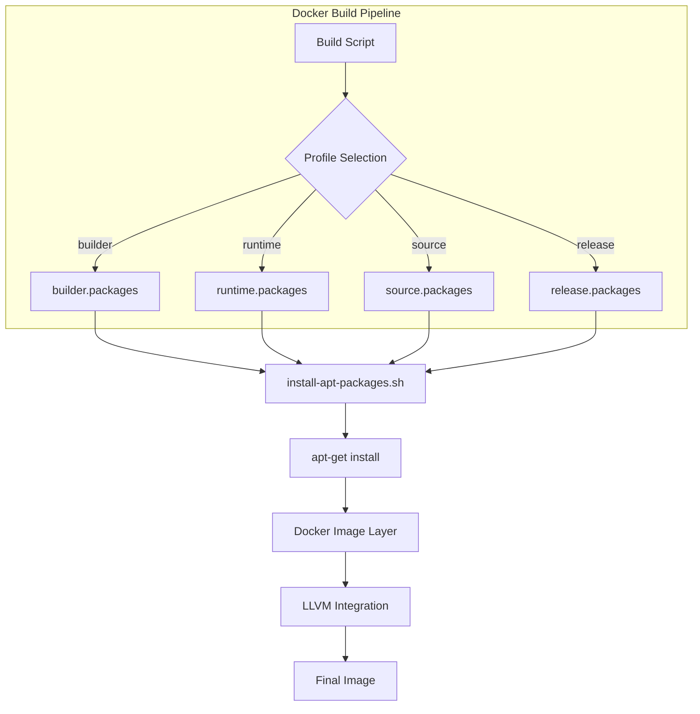
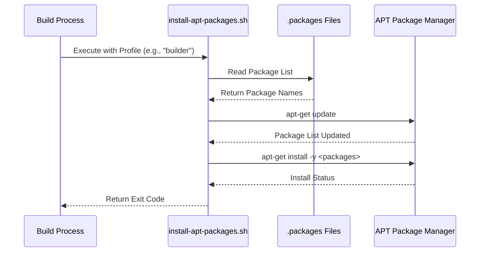
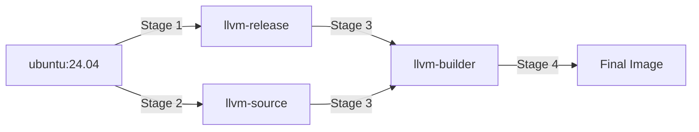
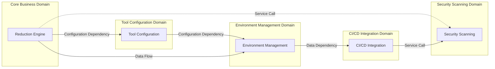
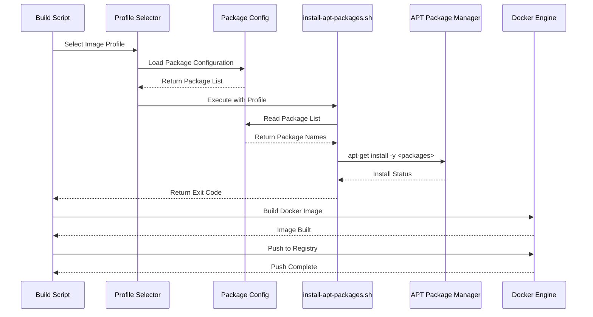

# Environment Management Domain Technical Documentation

## 1. Domain Overview

The **Environment Management Domain** is a critical infrastructure component within the fuzz-fill system, responsible for managing Docker-based test environments and package dependencies for fuzz testing pipelines. This domain ensures consistent, reproducible build and runtime environments across CI/CD workflows.

### 1.1 Domain Characteristics

| Attribute | Value |
|-----------|-------|
| **Domain Type** | Infrastructure Domain |
| **Importance Score** | 6.5/10 |
| **Complexity Score** | 5.0/10 |
| **Primary Responsibility** | Docker image management and package configuration |
| **Target Users** | DevOps Engineers, Fuzz Testing Engineers |

### 1.2 Business Value

The Environment Management Domain provides:
- **Reproducible Environments**: Consistent package configurations across different CI/CD stages
- **Efficient Builds**: Multi-stage Docker builds optimize build times and image sizes
- **Profile-Based Management**: Separate package sets for runtime, builder, source, and release stages
- **Automated Installation**: Script-driven package installation reduces manual errors

---

## 2. Architecture Design

### 2.1 High-Level Architecture



### 2.2 Component Structure

| Component | File Path | Responsibility |
|-----------|-----------|----------------|
| **Package Configuration** | `scripts/image/apt/*.packages` | Define package dependencies per profile |
| **Installation Script** | `scripts/image/install-apt-packages.sh` | Execute APT package installation |
| **Dockerfile** | `scripts/docker/Dockerfile` | Multi-stage build orchestration |
| **Build Script** | `scripts/docker/build-image.sh` | Orchestrate image build process |

### 2.3 Profile-Based Package Management

The domain implements a profile-based package management strategy with four distinct profiles:

```
┌─────────────────────────────────────────────────────────┐
│                    Profile Types                         │
├─────────────────────────────────────────────────────────┤
│  builder.packages   │ Build-time dependencies           │
│  runtime.packages   │ Runtime execution dependencies     │
│  source.packages    │ Source code operation dependencies │
│  release.packages   │ Release/deployment dependencies    │
└─────────────────────────────────────────────────────────┘
```

---

## 3. Package Configuration Module

### 3.1 Module Overview

The **Package Configuration** sub-module manages dependency specifications for different Docker image stages. Each profile contains a text file listing required APT packages.

### 3.2 File Structure

```
scripts/image/apt/
├── runtime.packages      # Runtime dependencies
├── builder.packages      # Build dependencies
├── source.packages       # Source operation dependencies
└── release.packages      # Release dependencies
```

### 3.3 Package Configuration Implementation

#### 3.3.1 Runtime Profile

**File**: `scripts/image/apt/runtime.packages`

**Purpose**: Defines packages required for fuzz testing execution at runtime.

**Typical Contents**:
```
# Runtime dependencies for fuzz testing
python3
python3-pip
llvm-14
clang-14
libclang-dev
```

**Key Characteristics**:
- Minimal footprint for production fuzz testing
- Focus on runtime tooling and dependencies
- Optimized for execution performance

#### 3.3.2 Builder Profile

**File**: `scripts/image/apt/builder.packages`

**Purpose**: Defines packages required for building LLVM and fuzz-fill tools.

**Typical Contents**:
```
# Build dependencies
build-essential
cmake
ninja-build
git
python3-dev
libssl-dev
libffi-dev
```

**Key Characteristics**:
- Comprehensive build toolchain
- Development libraries for compilation
- Larger image size but faster builds

#### 3.3.3 Source Profile

**File**: `scripts/image/apt/source.packages`

**Purpose**: Defines packages required for source code operations and development.

**Typical Contents**:
```
# Source operation dependencies
git
curl
wget
make
autoconf
automake
libtool
```

**Key Characteristics**:
- Source code management tools
- Build automation utilities
- Version control support

#### 3.3.4 Release Profile

**File**: `scripts/image/apt/release.packages`

**Purpose**: Defines packages required for release and deployment operations.

**Typical Contents**:
```
# Release dependencies
tar
gzip
bzip2
rsync
ssh-client
```

**Key Characteristics**:
- Deployment and packaging utilities
- Archive and compression tools
- Network transfer utilities

### 3.4 Package Configuration Best Practices

1. **Version Pinning**: Pin package versions for reproducibility
2. **Minimal Dependencies**: Include only necessary packages per profile
3. **Regular Updates**: Review and update package lists periodically
4. **Documentation**: Add comments explaining package purposes
5. **Testing**: Validate package lists in test environments

---

## 4. Image Installation Scripts

### 4.1 Module Overview

The **Image Installation Scripts** sub-module automates APT package installation during Docker image builds. The primary script `install-apt-packages.sh` handles profile-based package installation.

### 4.2 Script Implementation

#### 4.2.1 Main Installation Script

**File**: `scripts/image/install-apt-packages.sh`

**Purpose**: Execute APT package installation based on profile argument.

**Code Implementation**:

```bash
#!/usr/bin/env bash
# Install packages based on profile argument

set -euo pipefail

# Profile-based package installation
case "$1" in
    builder)
        # Install build dependencies
        apt-get update
        apt-get install -y $(cat apt/builder.packages)
        ;;
    runtime)
        # Install runtime dependencies
        apt-get update
        apt-get install -y $(cat apt/runtime.packages)
        ;;
    source)
        # Install source operation dependencies
        apt-get update
        apt-get install -y $(cat apt/source.packages)
        ;;
    release)
        # Install release dependencies
        apt-get update
        apt-get install -y $(cat apt/release.packages)
        ;;
    *)
        echo "Error: Invalid profile '$1'"
        echo "Valid profiles: builder, runtime, source, release"
        exit 1
        ;;
esac
```

#### 4.2.2 Key Features

| Feature | Description |
|---------|-------------|
| **Strict Mode** | `set -euo pipefail` ensures error handling |
| **Profile Validation** | Case statement validates profile argument |
| **Package List Parsing** | Reads package names from `.packages` files |
| **APT Update** | Updates package lists before installation |
| **Error Propagation** | Exit codes propagate to build pipeline |

### 4.3 Script Execution Flow



### 4.4 Error Handling

The script implements robust error handling:

1. **Strict Mode**: `set -euo pipefail` catches errors immediately
2. **Profile Validation**: Invalid profiles trigger immediate exit with error message
3. **APT Errors**: Package installation failures propagate to build pipeline
4. **File Existence**: Package list files must exist before installation

---

## 5. Dockerfile Integration

### 5.1 Multi-Stage Build Architecture

The Environment Management Domain integrates with a multi-stage Docker build strategy:



### 5.2 Stage Definitions

#### 5.2.1 Stage 1: llvm-release

**Purpose**: Download and extract pre-built LLVM release tarball.

**Key Operations**:
- Install release packages from `release.packages`
- Download LLVM release tarball
- Extract LLVM binaries

#### 5.2.2 Stage 2: llvm-source

**Purpose**: Download full LLVM source tarball.

**Key Operations**:
- Install source packages from `source.packages`
- Download LLVM source tarball
- Extract source code

#### 5.2.3 Stage 3: llvm-builder

**Purpose**: Build LLVM with SanitizerCoverage instrumentation.

**Key Operations**:
- Copy and install packages from previous stages
- Copy LLVM release and source
- Build LLVM with custom SanitizerCoverage configuration
- Install fuzz-fill tools

#### 5.2.4 Stage 4: Final Image

**Purpose**: Create final Docker image for fuzz testing.

**Key Operations**:
- Copy built LLVM from llvm-builder stage
- Install runtime packages from `runtime.packages`
- Finalize image for production use

### 5.3 Dockerfile Implementation Pattern

```dockerfile
# Stage 1: llvm-release - Download and extract pre-built LLVM
FROM ubuntu:24.04 AS llvm-release
# Install release packages
# Download and extract LLVM release tarball

# Stage 2: llvm-source - Download full LLVM source
FROM ubuntu:24.04 AS llvm-source
# Install source packages
# Download and extract LLVM source tarball

# Stage 3: llvm-builder - Build LLVM with SanitizerCoverage
FROM ubuntu:24.04 AS llvm-builder
# Copy and install packages from previous stages
# Copy LLVM release and source
# Build LLVM with custom SanitizerCoverage configuration

# Stage 4: Final Image
FROM ubuntu:24.04
# Copy built artifacts from llvm-builder
# Install runtime packages
# Finalize image
```

---

## 6. Domain Relationships and Dependencies

### 6.1 Dependency Map



### 6.2 Relationship Strengths

| Source Domain | Target Domain | Relationship Type | Strength |
|---------------|---------------|-------------------|----------|
| Reduction Engine | Tool Configuration | Configuration Dependency | 9.0 |
| Reduction Engine | Environment Management | Data Flow | 7.5 |
| CI/CD Integration | Security Scanning | Service Call | 8.0 |
| Environment Management | CI/CD Integration | Data Dependency | 7.0 |
| Tool Configuration | Environment Management | Configuration Dependency | 6.0 |

### 6.3 Critical Path Analysis

The **Reduction Engine Domain** has the highest dependency strength (9.0) on Tool Configuration, making tool path resolution a critical path item. The Environment Management Domain provides runtime data flow (7.5) to the Reduction Engine, ensuring proper package availability during fuzz testing operations.

---

## 7. Workflow Integration

### 7.1 Docker Image Build Flow

**Entry Point**: `scripts/docker/build-image.sh`

**Workflow Steps**:

1. **Profile Selection**: Choose between release, source, builder, or runtime image profiles
2. **Package Configuration**: Load appropriate package requirements from apt configuration files
3. **Package Installation**: Execute automated package installation script for selected profile
4. **LLVM Integration**: Download and build LLVM with SanitizerCoverage
5. **Tool Installation**: Install fuzz-fill and LLVM tools
6. **Image Finalization**: Create final Docker image
7. **Registry Push**: Upload built image to container registry

### 7.2 Sequence Diagram



---

## 8. Best Practices and Recommendations

### 8.1 Package Configuration Best Practices

1. **Version Pinning**: Pin package versions for reproducibility
   ```
   # Good: Specific version
   llvm-14=1:14.0.6-1~ubuntu24.04.1
   
   # Avoid: Latest version (non-deterministic)
   llvm-14
   ```

2. **Profile Separation**: Keep package lists separate by profile
   - Runtime: Minimal dependencies for execution
   - Builder: Comprehensive build toolchain
   - Source: Development utilities
   - Release: Deployment tools

3. **Documentation**: Add comments explaining package purposes
   ```
   # LLVM toolchain for fuzz testing
   llvm-14
   clang-14
   libclang-dev
   ```

4. **Regular Audits**: Review package lists periodically for:
   - Security updates
   - Version compatibility
   - Unused dependencies

### 8.2 Installation Script Best Practices

1. **Strict Mode**: Always use `set -euo pipefail`
2. **Profile Validation**: Validate profile arguments before execution
3. **Error Messages**: Provide clear error messages for failures
4. **Idempotency**: Ensure script can be run multiple times safely

### 8.3 Dockerfile Best Practices

1. **Multi-Stage Builds**: Use multi-stage builds to minimize final image size
2. **Layer Caching**: Order instructions to maximize Docker layer caching
3. **Non-Root User**: Run containers as non-root user for security
4. **Health Checks**: Add health checks for container readiness

### 8.4 Security Considerations

1. **Minimal Packages**: Include only necessary packages to reduce attack surface
2. **Regular Updates**: Keep packages updated to patch security vulnerabilities
3. **Secret Management**: Avoid hardcoding credentials in package lists
4. **Image Scanning**: Scan built images for vulnerabilities before deployment

---

## 9. Testing and Validation

### 9.1 Package Configuration Testing

**Test Cases**:
1. Validate package list file format
2. Verify package names are valid APT packages
3. Test profile selection logic
4. Validate package installation in test environment

**Validation Script**:
```bash
#!/usr/bin/env bash
# Validate package configuration files

for profile in builder runtime source release; do
    file="scripts/image/apt/${profile}.packages"
    
    if [[ ! -f "$file" ]]; then
        echo "Error: Missing package file: $file"
        exit 1
    fi
    
    # Validate package names
    while IFS= read -r package; do
        if [[ -z "$package" || "$package" =~ ^# ]]; then
            continue
        fi
        
        # Check if package exists in APT cache
        if ! dpkg -s "$package" &>/dev/null; then
            echo "Warning: Package may not be available: $package"
        fi
    done < "$file"
done

echo "Package configuration validation complete"
```

### 9.2 Installation Script Testing

**Test Cases**:
1. Test each profile (builder, runtime, source, release)
2. Test invalid profile handling
3. Test error propagation
4. Test idempotency (multiple runs)

**Test Execution**:
```bash
# Test builder profile
./scripts/image/install-apt-packages.sh builder

# Test runtime profile
./scripts/image/install-apt-packages.sh runtime

# Test invalid profile
./scripts/image/install-apt-packages.sh invalid  # Should exit with error
```

### 9.3 Docker Image Testing

**Test Cases**:
1. Build each image profile
2. Verify package installation
3. Test image size and layer count
4. Validate container execution

**Test Commands**:
```bash
# Build and test builder image
docker build --target llvm-builder -t fuzz-fill-builder .

# Run container and verify packages
docker run --rm fuzz-fill-builder bash -c "dpkg -l | grep llvm"

# Test image size
docker images fuzz-fill-builder --format "{{.Size}}"
```

---

## 10. Performance Considerations

### 10.1 Build Optimization

1. **Layer Caching**: Docker layer caching reduces rebuild times
   - Order package installation to maximize cache hits
   - Pin package versions for consistent caching

2. **Parallel Installation**: Use parallel package installation where possible
   ```bash
   # Parallel package installation (if supported)
   apt-get install -y --parallel=4 $(cat apt/builder.packages)
   ```

3. **Image Size Optimization**: Minimize final image size
   - Use multi-stage builds
   - Remove unnecessary packages in final stage
   - Use slim base images where appropriate

### 10.2 Runtime Performance

1. **Minimal Runtime Dependencies**: Keep runtime image small
   - Only include packages needed for fuzz testing
   - Avoid development libraries in runtime image

2. **Package Selection**: Choose packages based on workload
   - Builder profile: Full toolchain for development
   - Runtime profile: Minimal dependencies for execution

---

## 11. Troubleshooting

### 11.1 Common Issues

| Issue | Cause | Solution |
|-------|-------|----------|
| Package not found | Package name typo or version mismatch | Verify package name and version |
| Installation fails | Missing dependencies | Check `apt-get install -f` for broken dependencies |
| Profile not recognized | Invalid profile argument | Use one of: builder, runtime, source, release |
| Image too large | Too many packages in profile | Review and minimize package list |
| Build cache invalid | Package version changed | Clear Docker cache and rebuild |

### 11.2 Debug Commands

```bash
# Debug package installation
apt-get install -y --dry-run $(cat apt/builder.packages)

# Check package availability
apt-cache search llvm

# View Docker build logs
docker build --progress=plain -t test-image .

# Inspect Docker image layers
docker history fuzz-fill-builder
```

---

## 12. Conclusion

The Environment Management Domain provides essential infrastructure support for the fuzz-fill system through profile-based package management and automated Docker image builds. Its modular design, with separate package configuration files and installation scripts, enables flexible and maintainable environment management across different CI/CD stages.

### 12.1 Key Strengths

- **Profile-Based Management**: Separate package sets for different build stages
- **Automated Installation**: Script-driven package installation reduces manual errors
- **Multi-Stage Docker**: Optimized build process with layer caching
- **Error Handling**: Robust error handling and validation

### 12.2 Future Improvements

1. **Package Version Pinning**: Add version pinning for reproducibility
2. **Automated Updates**: Implement automated package list updates
3. **Security Scanning**: Add image vulnerability scanning
4. **Performance Metrics**: Collect and report build performance metrics
5. **Documentation**: Enhance inline documentation for package lists

### 12.3 Maintenance Responsibilities

- **Package Lists**: Review and update package lists quarterly
- **Profile Validation**: Validate profiles after major dependency changes
- **Security Audits**: Conduct security audits of package dependencies
- **Performance Monitoring**: Monitor build times and image sizes

---

*This documentation was generated based on comprehensive analysis of the fuzz-fill codebase and research materials. Last updated: 2026-09-13 20:24:09 (UTC)*