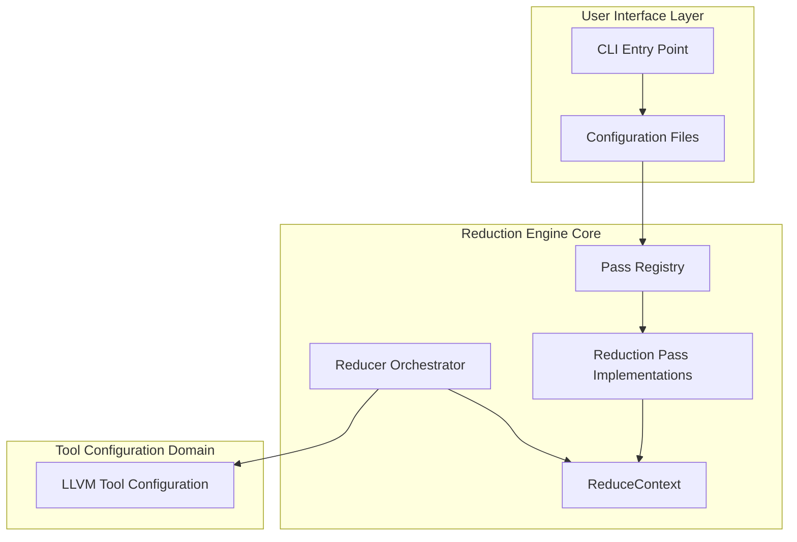
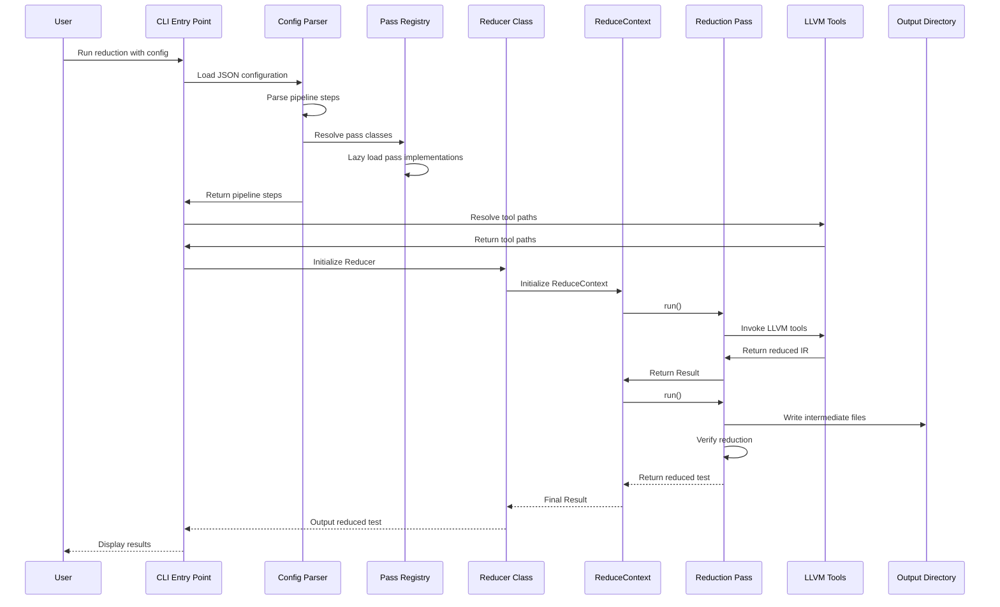
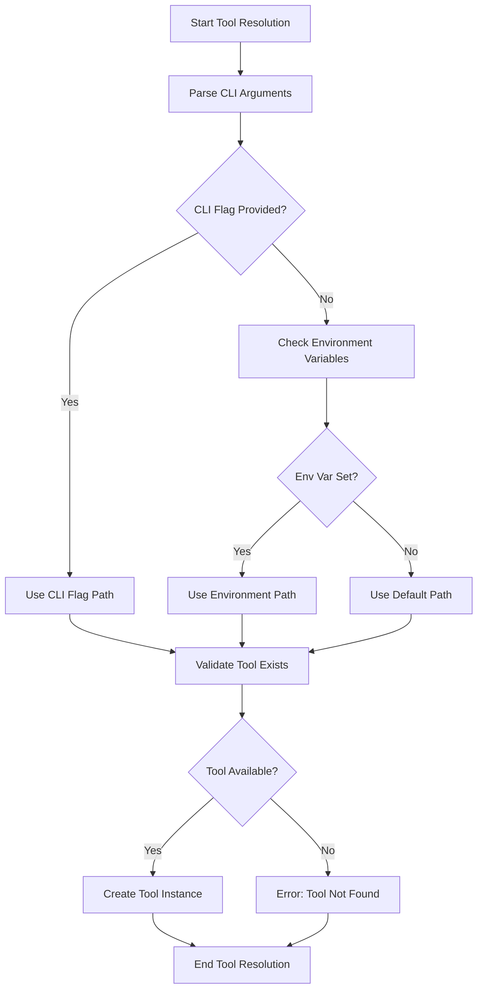

# Reduction Engine Domain Technical Documentation

## 1. Domain Overview

The **Reduction Engine Domain** serves as the core business logic of the Fuzz-Fill system, responsible for analyzing LLVM IR and reducing test cases to improve fuzz testing efficiency. This domain is the heart of the fuzz testing infrastructure, with an importance score of 9.0/10 and complexity of 8.5/10.

### 1.1 Primary Responsibilities

- **Test Case Reduction**: Analyzes LLVM IR to identify and reduce redundant test cases
- **Pipeline Orchestration**: Coordinates multiple reduction passes in a configurable sequence
- **Context Management**: Maintains reduction state across pipeline execution
- **Configuration Management**: Parses and validates reduction pipeline configurations

### 1.2 Domain Boundaries

| Included Components | Excluded Components |
|---------------------|---------------------|
| Test case reduction engine | Actual fuzz testing engine |
| LLVM tool integration | Target codebase being tested |
| Reduction pass implementations | LLVM compiler itself |
| Coverage gap analysis | Test frameworks and suites |
| Configuration management | Production deployment infrastructure |

---

## 2. Architecture Design

### 2.1 High-Level Architecture



### 2.2 Key Architectural Patterns

#### 2.2.1 Dependency Injection Pattern

The `Reducer` class receives all dependencies through constructor injection rather than creating them internally:

```python
class Reducer:
    def __init__(self, tools: ReduceTools, output_dir: Path, test: Test,
                 pipeline_steps: tuple[PipelineStep, ...]):
        # Dependencies injected, not created internally
        self.tools = tools
        self.output_dir = output_dir
        self.test = test
        self._pipeline_steps = pipeline_steps
```

This pattern ensures loose coupling and enables flexible testing.

#### 2.2.2 Registry Pattern with Lazy Loading

The pass registry implements lazy loading to avoid circular imports:

```python
def _pass_by_id() -> dict[str, type[ReducePass]]:
    """Built lazily so reducer can import this module without a cycle"""
    from reduce import reducer_pass as rp
    return {
        "snapshot": rp.SnapshotPass,
        "llvm_reduce_ir": rp.LlvmReduceIrPass,
        "creduce": rp.CreducePass,
        "llvm_reduce_mir": rp.LlvmReduceMirPass,
    }
```

This pattern enables the registry to be accessed without triggering circular import issues.

#### 2.2.3 Orchestration Pattern

The `Reducer` class orchestrates the entire reduction pipeline, managing:
- Pipeline step execution order
- Intermediate file management
- Test execution coordination
- Reduction verification

#### 2.2.4 Context Management Pattern

The `ReduceContext` dataclass manages per-run state including:
- Temporary file paths
- Test execution results
- Repository information
- Pipeline execution state

---

## 3. Core Components

### 3.1 Reducer Orchestrator

**File**: `src/reduce/reducer.py`

The `Reducer` class is the central orchestrator that manages the complete reduction pipeline execution.

#### 3.1.1 Key Responsibilities

1. **Pipeline Execution**: Executes reduction passes in the configured order
2. **Context Management**: Manages `ReduceContext` for state tracking
3. **Intermediate File Handling**: Coordinates temporary file creation and cleanup
4. **Verification**: Validates reduction success against interestingness criteria

#### 3.1.2 Core Methods

```python
class Reducer:
    def __init__(self, tools: ReduceTools, output_dir: Path, test: Test,
                 pipeline_steps: tuple[PipelineStep, ...]):
        """Initialize reducer with dependencies and configuration"""
        self.tools = tools
        self.output_dir = output_dir
        self.test = test
        self._pipeline_steps = pipeline_steps
    
    def reduce(self) -> Test:
        """Execute the complete reduction pipeline"""
        # 1. Initialize reduction context
        # 2. Execute pipeline steps in order
        # 3. Manage intermediate files
        # 4. Verify final reduction
        # 5. Return reduced test case
```

#### 3.1.3 Pipeline Step Coordination

The reducer manages intermediate files between pipeline steps:

```python
# Pipeline step execution flow
for step in pipeline_steps:
    # Execute pass
    result = step.run(ctx, test)
    
    # Manage intermediate file
    intermediate_path = ctx.tmp_dir / f"{step_id}.{ext}"
    
    # Verify reduction
    if not step.verify(ctx, test):
        # Handle reduction failure
        pass
```

### 3.2 Reduction Pass Implementations

**File**: `src/reduce/reducer_pass.py`

This module implements various LLVM IR reduction strategies, each targeting specific optimization goals.

#### 3.2.1 Pass Types and Responsibilities

| Pass | Description | Primary Function |
|------|-------------|------------------|
| `SnapshotPass` | Creates baseline snapshots | Capture state before reduction |
| `LlvmReduceIrPass` | LLVM IR-based reduction | Reduce LLVM IR code size |
| `CreducePass` | C-Reduce based reduction | Remove unnecessary C code |
| `LlvmReduceMirPass` | LLVM MIR-based reduction | Reduce LLVM Middle IR |

#### 3.2.2 Pass Interface

All reduction passes implement a common interface:

```python
class ReducePass(Protocol):
    def __init__(self, options: dict):
        """Initialize pass with configuration options"""
        ...
    
    def run(self, ctx: ReduceContext, test: Test) -> Test:
        """Execute reduction pass and return modified test"""
        ...
    
    def verify(self, ctx: ReduceContext, test: Test) -> bool:
        """Verify reduction success"""
        ...
```

#### 3.2.3 LlvmReduceIrPass Implementation

```python
class LlvmReduceIrPass:
    def __init__(self, options: dict):
        self.options = options
    
    def run(self, ctx: ReduceContext, test: Test):
        """Execute llvm-reduce with test script"""
        # 1. Prepare test script
        # 2. Invoke llvm-reduce tool
        # 3. Manage intermediate files
        # 4. Return reduced test
```

#### 3.2.4 CreducePass Implementation

```python
class CreducePass:
    def __init__(self, options: dict):
        self.options = options
    
    def run(self, ctx: ReduceContext, test: Test):
        """Execute C-Reduce based reduction"""
        # 1. Extract C code from LLVM IR
        # 2. Run C-Reduce tool
        # 3. Reconstruct LLVM IR
        # 4. Return reduced test
```

### 3.3 Pass Registry

**File**: `src/reduce/pass_registry.py`

The pass registry provides centralized pass ID to class mapping with lazy loading.

#### 3.3.1 Registry Structure

```python
def _pass_by_id() -> dict[str, type[ReducePass]]:
    """Built lazily so reducer can import this module without a cycle"""
    from reduce import reducer_pass as rp
    return {
        "snapshot": rp.SnapshotPass,
        "llvm_reduce_ir": rp.LlvmReduceIrPass,
        "creduce": rp.CreducePass,
        "llvm_reduce_mir": rp.LlvmReduceMirPass,
    }
```

#### 3.3.2 Pass ID Validation

```python
def passes_from_ids(pass_ids: list[str]) -> list[ReducePass]:
    """Lazy-loaded pass registry to avoid circular imports"""
    reg = _pass_by_id()
    out = []
    for pid in pass_ids:
        cls = reg.get(pid)
        if cls is None:
            raise SystemExit(f"Unknown pass id {pid!r}")
        out.append(cls())
    return out
```

### 3.4 Configuration Management

**File**: `src/reduce/config.py`

Handles loading and parsing of reduction configuration from JSON files.

#### 3.4.1 Configuration Structure

```python
# Example configuration structure
{
    "pipeline": [
        {
            "id": "snapshot",
            "options": {}
        },
        {
            "id": "llvm_reduce_ir",
            "options": {
                "script": "test_script.sh",
                "timeout": 300
            }
        }
    ]
}
```

#### 3.4.2 Configuration Parsing

```python
def load_config(config_path: Path) -> dict:
    """Load and validate reduction configuration from JSON file"""
    # 1. Parse JSON file
    # 2. Validate pipeline steps
    # 3. Resolve relative paths
    # 4. Return configuration object
```

#### 3.4.3 Pipeline Step Definition

```python
def passes_from_ids(pass_ids: list[str]) -> list[ReducePass]:
    """Resolve pass classes from pass IDs"""
    reg = _pass_by_id()
    out = []
    for pid in pass_ids:
        cls = reg.get(pid)
        if cls is None:
            raise SystemExit(f"Unknown pass id {pid!r}")
        out.append(cls())
    return out
```

### 3.5 ReduceContext

**File**: `src/reduce/reducer.py`

The `ReduceContext` dataclass manages reduction state and execution context.

#### 3.5.1 Context Structure

```python
@dataclass
class ReduceContext:
    tmp_dir: Path
    test_path: Path
    repo_path: Path
    results: dict
    timings: list
```

#### 3.5.2 Context Management

```python
def create_context(output_dir: Path, test: Test) -> ReduceContext:
    """Create reduction context for pipeline execution"""
    tmp_dir = output_dir / "tmp"
    tmp_dir.mkdir(parents=True, exist_ok=True)
    
    return ReduceContext(
        tmp_dir=tmp_dir,
        test_path=test.path,
        repo_path=test.repo,
        results={},
        timings=[]
    )
```

---

## 4. Business Flows

### 4.1 Test Case Reduction Flow



#### 4.1.1 Step-by-Step Execution

1. **Configuration Loading**: Parse JSON config for pipeline steps
2. **Tool Resolution**: Resolve LLVM tool paths from CLI/env
3. **Pass Execution**: Execute reduction passes in order
4. **Intermediate Management**: Handle temporary files between passes
5. **Verification**: Verify final reduction against interestingness script

### 4.2 Tool Configuration Resolution Flow



---

## 5. Integration with Other Domains

### 5.1 Tool Configuration Domain

**Dependency Strength**: 9.0/10 (Critical)

The Reduction Engine depends on the Tool Configuration Domain for:
- LLVM tool path resolution
- Environment variable fallbacks
- Tool availability validation

```python
# Dependency injection example
class Reducer:
    def __init__(self, tools: ReduceTools, ...):
        self.tools = tools  # Injected from Tool Configuration Domain
```

### 5.2 Environment Management Domain

**Dependency Strength**: 7.5/10 (Data Flow)

The Reduction Engine requires runtime packages from the Environment Management Domain:
- LLVM tool binaries
- Reduction utilities
- Test execution environment

### 5.3 Security Scanning Domain

**Dependency Strength**: 5.0/10 (Optional Service Call)

The Reduction Engine may trigger security scanning as part of CI/CD pipeline integration:
- Post-reduction security validation
- Test case security analysis

---

## 6. Configuration Management

### 6.1 Configuration File Format

```json
{
  "pipeline": [
    {
      "id": "snapshot",
      "options": {}
    },
    {
      "id": "llvm_reduce_ir",
      "options": {
        "script": "test_script.sh",
        "timeout": 300,
        "max_iterations": 100
      }
    },
    {
      "id": "creduce",
      "options": {
        "max_reductions": 50
      }
    },
    {
      "id": "llvm_reduce_mir",
      "options": {}
    }
  ]
}
```

### 6.2 Configuration Validation

```python
def validate_config(config: dict) -> bool:
    """Validate reduction configuration"""
    # 1. Check required fields
    # 2. Validate pass IDs
    # 3. Validate options
    # 4. Resolve relative paths
    return True
```

### 6.3 Pipeline Step Definition

```python
@dataclass
class PipelineStep:
    id: str
    options: dict
```

---

## 7. Error Handling and Validation

### 7.1 Tool Availability Validation

```python
def validate_tool_exists(tool_path: Path) -> bool:
    """Verify tool executable is available"""
    if not tool_path.exists():
        raise SystemExit(f"Tool not found: {tool_path}")
    if not os.access(tool_path, os.X_OK):
        raise SystemExit(f"Tool not executable: {tool_path}")
    return True
```

### 7.2 Reduction Failure Handling

```python
def handle_reduction_failure(pass_name: str, error: Exception):
    """Handle reduction pass failures gracefully"""
    log.error(f"Reduction pass {pass_name} failed: {error}")
    # Options:
    # 1. Continue with next pass
    # 2. Retry with different parameters
    # 3. Abort pipeline
```

### 7.3 Configuration Error Messages

```python
def validate_pass_id(pass_id: str) -> None:
    """Validate pass ID against known passes"""
    known_passes = ["snapshot", "llvm_reduce_ir", "creduce", "llvm_reduce_mir"]
    if pass_id not in known_passes:
        raise SystemExit(f"Unknown pass id {pass_id!r}. Valid options: {known_passes}")
```

---

## 8. Performance Considerations

### 8.1 Intermediate File Management

Ordered temporary files for pipeline steps:

```python
def tmp_pass_path(tmp_dir: Path, step: int, slug: str, ext: str = "ll") -> Path:
    """Generate ordered temporary file paths for pipeline steps"""
    return tmp_dir / f"{step:02d}_{slug}.{ext}"
```

### 8.2 Lazy Loading

Pass registry avoids unnecessary imports:

```python
# Lazy loading prevents circular imports
def _pass_by_id() -> dict[str, type[ReducePass]]:
    """Built lazily so reducer can import this module without a cycle"""
    from reduce import reducer_pass as rp
    return {...}
```

### 8.3 Context Isolation

Per-run context prevents state leakage:

```python
def create_context(output_dir: Path, test: Test) -> ReduceContext:
    """Create isolated context for each reduction run"""
    tmp_dir = output_dir / "tmp"
    tmp_dir.mkdir(parents=True, exist_ok=True)
    return ReduceContext(tmp_dir=tmp_dir, ...)
```

---

## 9. Security Considerations

### 9.1 Tool Path Validation

```python
def validate_tool_path(tool_path: Path) -> Path:
    """Validate and sanitize tool path"""
    resolved = tool_path.expanduser().resolve()
    # Check for path traversal
    if not str(resolved).startswith(str(output_dir)):
        raise ValueError(f"Invalid tool path: {resolved}")
    return resolved
```

### 9.2 Intermediate File Cleanup

```python
def cleanup_context(ctx: ReduceContext):
    """Clean up temporary files after reduction"""
    if ctx.tmp_dir.exists():
        shutil.rmtree(ctx.tmp_dir)
```

---

## 10. Testing and Validation

### 10.1 Unit Test Coverage

Key areas requiring comprehensive unit tests:
- Reduction pass implementations
- Configuration parsing and validation
- Context management
- Tool path resolution

### 10.2 Integration Testing

Recommended integration test scenarios:
- Full pipeline execution with mock LLVM tools
- Configuration validation with invalid inputs
- Error handling for tool failures
- Intermediate file management

---

## 11. Summary

The Reduction Engine Domain is the core business logic of Fuzz-Fill, implementing a robust pipeline-based architecture for LLVM IR test case reduction. Key strengths include:

- **Clear Separation of Concerns**: Distinct modules for orchestration, pass implementation, and configuration
- **Dependency Injection**: Flexible tool configuration through constructor injection
- **Registry Pattern**: Lazy loading avoids circular imports
- **Context Management**: Per-run isolation prevents state leakage
- **Comprehensive Error Handling**: Graceful degradation for tool failures

The domain integrates tightly with the Tool Configuration Domain and Environment Management Domain, while optionally interacting with the Security Scanning Domain for CI/CD pipeline validation.